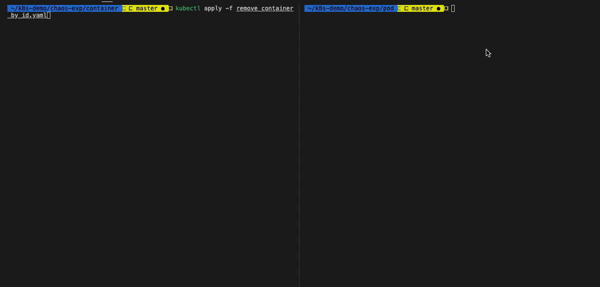
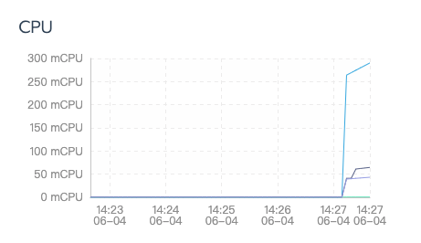
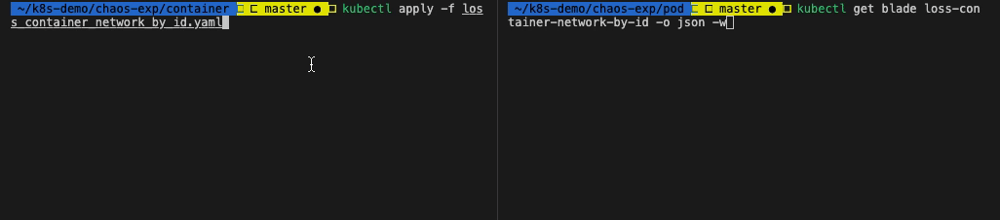
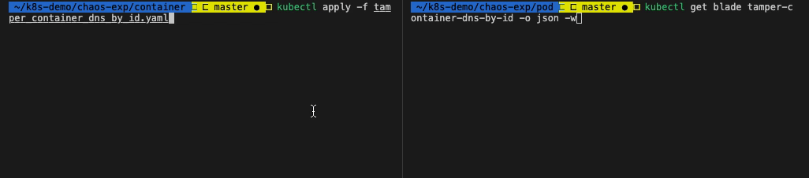
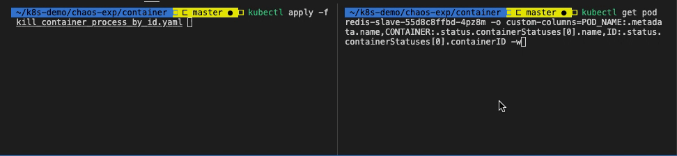
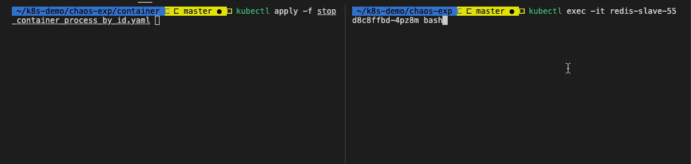

# Container 实验场景

- container 资源自身的场景
  - [删除 container](remove_container_by_id.yaml)
- [container 内 CPU 负载场景](increase_container_cpu_load_by_id.yaml)
- container 内网络实验场景
  - [container 网络延迟场景](delay_container_network_by_id.yaml)
  - [container 网络丢包场景](loss_container_network_by_id.yaml)
  - [container 域名访问异常场景](tamper_container_dns_by_id.yaml)
- container 内进程场景
  - [杀 container 内指定进程](kill_container_process_by_id.yaml)
  - [挂起 container 内指定进程](stop_container_process_by_id.yaml)

**参数**

Container 资源均支持以下参数。

| 参数 | 类型 | 说明 | 默认值 |
| --- | --- | --- | --- |
| `container-ids` | string | 容器ID，支持配置多个 | |
| `container-names` | string | 容器名称，支持配置多个 | |
| `docker-endpoint` | string | Docker server 地址 | 默认为本地的 `/var/run/docker.sock` |
| `namespace` | string | Pod 所属的命名空间 | default |
| `evict-count` | string | 限制实验生效的数量 | |
| `evict-percent` | string | 限制实验生效数量的百分比，不包含 % | |
| `labels` | string | Pod 资源标签，多个标签之间是或的关系 | |
| `names` | string | Pod 资源名 | |
| `waiting-time` | string | 实验结果等待时间，参数值要包含单位，例如 10s，1m | 20s |
| `force` |  | 是否强制删除 | |

## container 资源自身的场景

### 删除 container

删除 chaosblade 命名空间下，Pod 名为 `guestbook-7b87b7459f-cqkq2` 中 container id 是 `c6cdcf60b82b854bc4bab64308b466102245259d23e14e449590a8ed816403ed` 的容器。

**开始实验**

获取 container 名称：

```bash
$ kubectl get pod guestbook-7b87b7459f-cqkq2 -o custom-columns=CONTAINER:.status.containerStatuses[0].name,ID:.status.containerStatuses[0].containerID
```

修改 `remove_container_by_id.yaml` 中的 `container-ids` 和 `names`。

执行命令，开始实验：

```bash
$ kubectl apply -f remove_container_by_id.yaml
```

**查看实验状态**

执行 `kubectl get blade remove-container-by-id -o json` 命令，查看实验状态：

```json
{
    "apiVersion": "chaosblade.io/v1alpha1",
    "kind": "ChaosBlade",
    "metadata": {
        "annotations": {
            "kubectl.kubernetes.io/last-applied-configuration": "{\"apiVersion\":\"chaosblade.io/v1alpha1\",\"kind\":\"ChaosBlade\",\"metadata\":{\"annotations\":{},\"name\":\"remove-container-by-id\"},\"spec\":{\"experiments\":[{\"action\":\"remove\",\"desc\":\"remove container by id\",\"matchers\":[{\"name\":\"container-ids\",\"value\":[\"5600afacf083f9ddb43fa43c186de235c18313ab1194844ad03b241ba8158166\"]},{\"name\":\"names\",\"value\":[\"guestbook-7b87b7459f-cqkq2\"]},{\"name\":\"namespace\",\"value\":[\"chaosblade\"]}],\"scope\":\"container\",\"target\":\"container\"}]}}\n"
        },
        "creationTimestamp": "2020-06-04T03:31:18Z",
        "finalizers": [
            "finalizer.chaosblade.io"
        ],
        "generation": 1,
        "name": "remove-container-by-id",
        "resourceVersion": "145441",
        "selfLink": "/apis/chaosblade.io/v1alpha1/chaosblades/remove-container-by-id",
        "uid": "8bc90e2e-9456-455f-81de-c6522e75a653"
    },
    "spec": {
        "experiments": [
            {
                "action": "remove",
                "desc": "remove container by id",
                "matchers": [
                    {
                        "name": "container-ids",
                        "value": [
                            "5600afacf083f9ddb43fa43c186de235c18313ab1194844ad03b241ba8158166"
                        ]
                    },
                    {
                        "name": "names",
                        "value": [
                            "guestbook-7b87b7459f-cqkq2"
                        ]
                    },
                    {
                        "name": "namespace",
                        "value": [
                            "chaosblade"
                        ]
                    }
                ],
                "scope": "container",
                "target": "container"
            }
        ]
    },
    "status": {
        "expStatuses": [
            {
                "action": "remove",
                "resStatuses": [
                    {
                        "id": "641cf55a4372a157",
                        "kind": "container",
                        "name": "guestbook",
                        "nodeName": "keking",
                        "state": "Success",
                        "success": true,
                        "uid": "5600afacf083f9ddb43fa43c186de235c18313ab1194844ad03b241ba8158166"
                    }
                ],
                "scope": "container",
                "state": "Success",
                "success": true,
                "target": "container"
            }
        ],
        "phase": "Running"
    }
}
```

**观测结果**



**停止实验**

执行命令：`kubectl delete -f remove_container_by_id.yaml`

或者直接删除 blade 资源：`kubectl delete blade remove-container-by-id`

## container 内CPU负载场景

指定 chaosblade 命名空间下 Pod 名为 `guestbook-7b87b7459f-cqkq2`，container id 为 2ff814b246f86，使其 CPU 负载为 100%。

**实验准备**

由于使用 helm 安装的 [guestbook](https://github.com/cloudnativeapp/guestbook?spm=5176.2020520152.0.0.7c5f16ddH8myx6) 没有对资源进行限制，进行负载实验的话，会导致整个节点的故障，所以在实验之前需要**对资源进行限制**。

```bash
$ kubectl patch deployment redis-slave --patch '{"spec": {"template": {"spec": {"containers": [{"name": "redis-slave","resources": {"limits":{"cpu":"300m","memory":"512Mi"} }}]}}}}'
```

**开始实验**

获取 container 名称：

```bash
$ kubectl get pod redis-slave-55d8c8ffbd-jd8sm -o custom-columns=CONTAINER:.status.containerStatuses[0].name,ID:.status.containerStatuses[0].containerID
```

修改 `increase_container_cpu_load_by_id.yaml` 中的 `container-ids` 和 `names`。

**查看实验状态**

执行命令：`kubectl get blade increase-container-cpu-load-by-id -o json`，查看实验状态：

```json
{
    "apiVersion": "chaosblade.io/v1alpha1",
    "kind": "ChaosBlade",
    "metadata": {
        "annotations": {
            "kubectl.kubernetes.io/last-applied-configuration": "{\"apiVersion\":\"chaosblade.io/v1alpha1\",\"kind\":\"ChaosBlade\",\"metadata\":{\"annotations\":{},\"name\":\"increase-container-cpu-load-by-id-new\"},\"spec\":{\"experiments\":[{\"action\":\"fullload\",\"desc\":\"increase container cpu load by id\",\"matchers\":[{\"name\":\"container-ids\",\"value\":[\"5ad91eb49c1c6f8357e8d455fd27dad5d0c01c5cc3df36a3acdb1abc75f68a11\"]},{\"name\":\"cpu-percent\",\"value\":[\"100\"]},{\"name\":\"names\",\"value\":[\"redis-slave-55d8c8ffbd-jd8sm\"]},{\"name\":\"namespace\",\"value\":[\"chaosblade\"]}],\"scope\":\"container\",\"target\":\"cpu\"}]}}\n"
        },
        "creationTimestamp": "2020-06-04T06:26:44Z",
        "deletionGracePeriodSeconds": 0,
        "deletionTimestamp": "2020-06-04T06:28:48Z",
        "finalizers": [
            "finalizer.chaosblade.io"
        ],
        "generation": 2,
        "name": "increase-container-cpu-load-by-id-new",
        "resourceVersion": "170473",
        "selfLink": "/apis/chaosblade.io/v1alpha1/chaosblades/increase-container-cpu-load-by-id-new",
        "uid": "51955fd7-a6af-403a-915d-dd25bea73699"
    },
    "spec": {
        "experiments": [
            {
                "action": "fullload",
                "desc": "increase container cpu load by id",
                "matchers": [
                    {
                        "name": "container-ids",
                        "value": [
                            "5ad91eb49c1c6f8357e8d455fd27dad5d0c01c5cc3df36a3acdb1abc75f68a11"
                        ]
                    },
                    {
                        "name": "cpu-percent",
                        "value": [
                            "100"
                        ]
                    },
                    {
                        "name": "names",
                        "value": [
                            "redis-slave-55d8c8ffbd-jd8sm"
                        ]
                    },
                    {
                        "name": "namespace",
                        "value": [
                            "chaosblade"
                        ]
                    }
                ],
                "scope": "container",
                "target": "cpu"
            }
        ]
    },
    "status": {
        "expStatuses": [
            {
                "action": "fullload",
                "resStatuses": [
                    {
                        "id": "28a075b31562ba6f",
                        "kind": "container",
                        "name": "redis-slave",
                        "nodeName": "keking",
                        "state": "Success",
                        "success": true,
                        "uid": "5ad91eb49c1c6f8357e8d455fd27dad5d0c01c5cc3df36a3acdb1abc75f68a11"
                    }
                ],
                "scope": "container",
                "state": "Success",
                "success": true,
                "target": "cpu"
            }
        ],
        "phase": "Running"
    }
}
```

**观测结果**

可从监控系统观测到结果



**停止实验**

执行命令：`kubectl delete -f increase_container_cpu_load_by_id.yaml`

或者直接删除 blade 资源：`kubectl delete blade increase-container-cpu-load-by-id`

## container 内网络实验场景

该场景与 Pod 实验场景类似。

### container 网络延迟场景

对 chaosblade 命名空间中，对 `redis-master-68857cd57c-hknb6` Pod 中 container id 是 `02655dfdd9f0f712a10d63fdc6721f4dcee0a390e37717fff068bf3f85abf85e` 的容器的 6379 端口添加 3000 毫秒访问延迟，延迟时间上下浮动 1000 毫秒。

**实验参数**

| 参数 | 类型 | 说明 |
| --- | --- | --- |
| `destination-ip` | string | 目标 IP. 支持通过子网掩码来指定一个网段的IP地址, 例如 192.168.1.0/24. 则 192.168.1.0~192.168.1.255 都生效。你也可以指定固定的 IP，如 192.168.1.1 或者 192.168.1.1/32，也可以通过都号分隔多个参数，例如 192.168.1.1,192.168.2.1。 |
| `exclude-port` | string | 排除掉的端口，默认会忽略掉通信的对端端口，目的是保留通信可用。可以指定多个，使用逗号分隔或者连接符表示范围，例如 22,8000 或者 8000-8010。 这个参数不能与 --local-port 或者 --remote-port 参数一起使用。 |
| `exclude-ip` | string | 排除受影响的 IP，支持通过子网掩码来指定一个网段的IP地址, 例如 192.168.1.0/24. 则 192.168.1.0~192.168.1.255 都生效。你也可以指定固定的 IP，如 192.168.1.1 或者 192.168.1.1/32，也可以通过都号分隔多个参数，例如 192.168.1.1,192.168.2.1。 |
| `interface` | string | 网卡设备，例如 eth0 (必要参数)。 |
| `local-port` | string | 本地端口，一般是本机暴露服务的端口。可以指定多个，使用逗号分隔或者连接符表示范围，例如 80,8000-8080。 |
| `offset` | string | 延迟时间上下浮动的值, 单位是毫秒。 |
| `remote-port` | string | 远程端口，一般是要访问的外部暴露服务的端口。可以指定多个，使用逗号分隔或者连接符表示范围，例如 80,8000-8080。 |
| `time` | string | 延迟时间，单位是毫秒 (必要参数)。 |
| `force` |  | 强制覆盖已有的 tc 规则，请务必在明确之前的规则可覆盖的情况下使用。 |
| `ignore-peer-port` |  | 针对添加 --exclude-port 参数，报 ss 命令找不到的情况下使用，忽略排除端口。 |
| `timeout` | string | 设定运行时长，单位是秒，通用参数。 |

**开始实验**

获取 Pod 名称和 container id：

```bash
$ kubectl get pod redis-master-68857cd57c-hknb6 -o custom-columns=POD_NAME:.metadata.name,CONTAINER:.status.containerStatuses[0].name,ID:.status.containerStatuses[0].containerID
```

修改 `delay_container_network_by_id.yaml` 中的 `container-ids` 和 `names`。

执行命令，开始实验：

```bash
$ kubectl apply -f delay_container_network_by_id.yaml
```

**查看实验状态**

执行 `kubectl get blade delay-container-network-by-id -o json` 命令，查看实验状态：

```json
{
    "apiVersion": "chaosblade.io/v1alpha1",
    "kind": "ChaosBlade",
    "metadata": {
        "annotations": {
            "kubectl.kubernetes.io/last-applied-configuration": "{\"apiVersion\":\"chaosblade.io/v1alpha1\",\"kind\":\"ChaosBlade\",\"metadata\":{\"annotations\":{},\"name\":\"delay-container-network-by-id\"},\"spec\":{\"experiments\":[{\"action\":\"delay\",\"desc\":\"delay container network by container id\",\"matchers\":[{\"name\":\"container-ids\",\"value\":[\"02655dfdd9f0f712a10d63fdc6721f4dcee0a390e37717fff068bf3f85abf85e\"]},{\"name\":\"names\",\"value\":[\"redis-master-68857cd57c-hknb6\"]},{\"name\":\"namespace\",\"value\":[\"chaosblade\"]},{\"name\":\"local-port\",\"value\":[\"6379\"]},{\"name\":\"interface\",\"value\":[\"eth0\"]},{\"name\":\"time\",\"value\":[\"3000\"]},{\"name\":\"offset\",\"value\":[\"1000\"]}],\"scope\":\"container\",\"target\":\"network\"}]}}\n"
        },
        "creationTimestamp": "2020-06-04T07:23:55Z",
        "finalizers": [
            "finalizer.chaosblade.io"
        ],
        "generation": 1,
        "name": "delay-container-network-by-id",
        "resourceVersion": "178235",
        "selfLink": "/apis/chaosblade.io/v1alpha1/chaosblades/delay-container-network-by-id",
        "uid": "d63730e6-4039-49f3-93fb-ba0936bc50ac"
    },
    "spec": {
        "experiments": [
            {
                "action": "delay",
                "desc": "delay container network by container id",
                "matchers": [
                    {
                        "name": "container-ids",
                        "value": [
                            "02655dfdd9f0f712a10d63fdc6721f4dcee0a390e37717fff068bf3f85abf85e"
                        ]
                    },
                    {
                        "name": "names",
                        "value": [
                            "redis-master-68857cd57c-hknb6"
                        ]
                    },
                    {
                        "name": "namespace",
                        "value": [
                            "chaosblade"
                        ]
                    },
                    {
                        "name": "local-port",
                        "value": [
                            "6379"
                        ]
                    },
                    {
                        "name": "interface",
                        "value": [
                            "eth0"
                        ]
                    },
                    {
                        "name": "time",
                        "value": [
                            "3000"
                        ]
                    },
                    {
                        "name": "offset",
                        "value": [
                            "1000"
                        ]
                    }
                ],
                "scope": "container",
                "target": "network"
            }
        ]
    },
    "status": {
        "expStatuses": [
            {
                "action": "delay",
                "resStatuses": [
                    {
                        "id": "91c03ddd172ce1a5",
                        "kind": "container",
                        "name": "redis-master",
                        "nodeName": "keking",
                        "state": "Success",
                        "success": true,
                        "uid": "02655dfdd9f0f712a10d63fdc6721f4dcee0a390e37717fff068bf3f85abf85e"
                    }
                ],
                "scope": "container",
                "state": "Success",
                "success": true,
                "target": "network"
            }
        ],
        "phase": "Running"
    }
}
```

**观测结果**

```bash
# 获取实验 pod ip
$ kubectl get pod -l app=redis,role=master -o jsonpath={.items..status.podIP}
10.42.0.19
# 进入观测 pod
$ kubectl exec -it redis-slave-55d8c8ffbd-jd8sm bash
# 在 pod 中安装 telnet
$ apt-get update && apt-get install -y telnet
# 测试时间
$ time echo "" | telnet 10.42.0.19 6379
Trying 10.42.0.19...
Connected to 10.42.0.19.
Escape character is '^]'.
Connection closed by foreign host.

real    0m3.790s
user    0m0.007s
sys     0m0.001s
```


可以看到结果符合预期。

**停止实验**

执行命令：`kubectl delete -f delay_container_network_by_id.yaml`

或者直接删除 blade 资源：`kubectl delete blade delay-container-network-by-id`

### container 网络丢包场景

对 chaosblade 命名空间中，对 `redis-master-68857cd57c-hknb6` Pod 中 container id 是 `02655dfdd9f0f712a10d63fdc6721f4dcee0a390e37717fff068bf3f85abf85e` 的容器注入丢包率 100% 的故障，只针对 IP 为 `10.42.0.26` 的 pod 生效，也就是除 `10.42.0.26` 以外的 pod 都能正常访问 `redis-master-68857cd57c-hknb6`。

**实验参数**

| 参数 | 类型 | 说明 |
| --- | --- | --- |
| `destination-ip` | string | 目标 IP. 支持通过子网掩码来指定一个网段的IP地址, 例如 192.168.1.0/24. 则 192.168.1.0~192.168.1.255 都生效。你也可以指定固定的 IP，如 192.168.1.1 或者 192.168.1.1/32，也可以通过都号分隔多个参数，例如 192.168.1.1,192.168.2.1。 |
| `exclude-port` | string | 排除掉的端口，默认会忽略掉通信的对端端口，目的是保留通信可用。可以指定多个，使用逗号分隔或者连接符表示范围，例如 22,8000 或者 8000-8010。 这个参数不能与 --local-port 或者 --remote-port 参数一起使用。 |
| `exclude-ip` | string | 排除受影响的 IP，支持通过子网掩码来指定一个网段的IP地址, 例如 192.168.1.0/24. 则 192.168.1.0~192.168.1.255 都生效。你也可以指定固定的 IP，如 192.168.1.1 或者 192.168.1.1/32，也可以通过都号分隔多个参数，例如 192.168.1.1,192.168.2.1。 |
| `interface` | string | 网卡设备，例如 eth0 (必要参数)。 |
| `local-port` | string | 本地端口，一般是本机暴露服务的端口。可以指定多个，使用逗号分隔或者连接符表示范围，例如 80,8000-8080。 |
| `percent` | string | 丢包百分比，取值在[0, 100]的正整数 (必要参数)。 |
| `remote-port` | string | 远程端口，一般是要访问的外部暴露服务的端口。可以指定多个，使用逗号分隔或者连接符表示范围，例如 80,8000-8080。 |
| `force` |  | 强制覆盖已有的 tc 规则，请务必在明确之前的规则可覆盖的情况下使用。 |
| `ignore-peer-port` |  | 针对添加 --exclude-port 参数，报 ss 命令找不到的情况下使用，忽略排除端口。 |
| `timeout` | string | 设定运行时长，单位是秒，通用参数。 |

**开始实验**

获取 pod 名称和 container id 内容同上。

执行命令，开始实验：

```bash
$ kubectl apply -f loss_container_network_by_id.yaml
```

**查看实验状态**

执行 `kubectl get blade loss-container-network-by-id -o json` 命令，查看实验状态：

```json
{
    "apiVersion": "chaosblade.io/v1alpha1",
    "kind": "ChaosBlade",
    "metadata": {
        "annotations": {
            "kubectl.kubernetes.io/last-applied-configuration": "{\"apiVersion\":\"chaosblade.io/v1alpha1\",\"kind\":\"ChaosBlade\",\"metadata\":{\"annotations\":{},\"name\":\"loss-container-network-by-id\"},\"spec\":{\"experiments\":[{\"action\":\"loss\",\"desc\":\"loss container network by container id\",\"matchers\":[{\"name\":\"container-ids\",\"value\":[\"02655dfdd9f0f712a10d63fdc6721f4dcee0a390e37717fff068bf3f85abf85e\"]},{\"name\":\"names\",\"value\":[\"redis-master-68857cd57c-hknb6\"]},{\"name\":\"namespace\",\"value\":[\"chaosblade\"]},{\"name\":\"interface\",\"value\":[\"eth0\"]},{\"name\":\"percent\",\"value\":[\"100\"]},{\"name\":\"timeout\",\"value\":[\"60\"]},{\"name\":\"destination-ip\",\"value\":[\"10.42.0.26\"]}],\"scope\":\"container\",\"target\":\"network\"}]}}\n"
        },
        "creationTimestamp": "2020-06-04T07:41:37Z",
        "deletionGracePeriodSeconds": 0,
        "deletionTimestamp": "2020-06-04T07:42:50Z",
        "finalizers": [
            "finalizer.chaosblade.io"
        ],
        "generation": 2,
        "name": "loss-container-network-by-id",
        "resourceVersion": "180856",
        "selfLink": "/apis/chaosblade.io/v1alpha1/chaosblades/loss-container-network-by-id",
        "uid": "d64873ae-3956-4660-9e35-27241bd48fa4"
    },
    "spec": {
        "experiments": [
            {
                "action": "loss",
                "desc": "loss container network by container id",
                "matchers": [
                    {
                        "name": "container-ids",
                        "value": [
                            "02655dfdd9f0f712a10d63fdc6721f4dcee0a390e37717fff068bf3f85abf85e"
                        ]
                    },
                    {
                        "name": "names",
                        "value": [
                            "redis-master-68857cd57c-hknb6"
                        ]
                    },
                    {
                        "name": "namespace",
                        "value": [
                            "chaosblade"
                        ]
                    },
                    {
                        "name": "interface",
                        "value": [
                            "eth0"
                        ]
                    },
                    {
                        "name": "percent",
                        "value": [
                            "100"
                        ]
                    },
                    {
                        "name": "timeout",
                        "value": [
                            "60"
                        ]
                    },
                    {
                        "name": "destination-ip",
                        "value": [
                            "10.42.0.26"
                        ]
                    }
                ],
                "scope": "container",
                "target": "network"
            }
        ]
    },
    "status": {
        "expStatuses": [
            {
                "action": "loss",
                "resStatuses": [
                    {
                        "id": "8ad94f6be81dec80",
                        "kind": "container",
                        "name": "redis-master",
                        "nodeName": "keking",
                        "state": "Success",
                        "success": true,
                        "uid": "02655dfdd9f0f712a10d63fdc6721f4dcee0a390e37717fff068bf3f85abf85e"
                    }
                ],
                "scope": "container",
                "state": "Success",
                "success": true,
                "target": "network"
            }
        ],
        "phase": "Running"
    }
}
```

**观测结果**

```bash
# 获取实验 pod ip
$ kubectl get pod -l app=redis,role=master -o jsonpath={.items..status.podIP}
10.42.0.19
# 进入观测 pod，IP为：10.42.0.26（被设置丢包率 100%）
$ kubectl exec -it redis-slave-55d8c8ffbd-jd8sm bash
# Ping 实验Pod ip
$ ping 10.42.0.19
PING 10.42.0.19 (10.42.0.19) 56(84) bytes of data.
# 无响应

# 进入观测 pod，该 pod 未被指定丢包
$ kubectl exec -it redis-slave-55d8c8ffbd-22tsc bash
# Ping 实验Pod ip
$ ping 10.42.0.19
PING 10.42.0.19 (10.42.0.19) 56(84) bytes of data.
64 bytes from 10.42.0.19: icmp_seq=1 ttl=64 time=0.065 ms
64 bytes from 10.42.0.19: icmp_seq=2 ttl=64 time=0.051 ms
64 bytes from 10.42.0.19: icmp_seq=3 ttl=64 time=0.078 ms
...
# 响应正常
```



这里在配置中还将 `timeout` 设置为 60 秒，60 秒后 100% 丢包的情况将会消失，这个配置是为了防止因丢包率设置太高，造成机器无法连接的情况。与其有相似功能的还有 `exclude-port`，该配置用来指定排除掉的丢包端口。

**停止实验**

执行命令：`kubectl apply -f loss_container_network_by_id.yaml`

或者直接删除 blade 资源：`kubectl delete blade loss-container-network-by-id`

### container 域名访问异常场景

本实验通过修改本地的 hosts，篡改域名地址映射，模拟 container 内域名访问异常场景。

**实验参数**

| 参数 | 类型 | 说明 |
| --- | --- | --- |
| `domain` | string | 域名 (必要参数) |
| `ip` | string | 映射的 ip (必要参数) |
| `timeout` | string | 设定运行时长，单位是秒，通用参数。 |

**开始实验**

获取 pod 名称和 container id 内容同上。

执行命令，开始实验：

```bash
$ kubectl apply -f tamper_container_dns_by_id.yaml
```

**查看实验状态**

执行 `kubectl get blade tamper-container-dns-by-id -o json` 命令，查看实验状态：

```json
{
    "apiVersion": "chaosblade.io/v1alpha1",
    "kind": "ChaosBlade",
    "metadata": {
        "annotations": {
            "kubectl.kubernetes.io/last-applied-configuration": "{\"apiVersion\":\"chaosblade.io/v1alpha1\",\"kind\":\"ChaosBlade\",\"metadata\":{\"annotations\":{},\"name\":\"tamper-container-dns-by-id\"},\"spec\":{\"experiments\":[{\"action\":\"dns\",\"desc\":\"tamper container dns by id\",\"matchers\":[{\"name\":\"container-ids\",\"value\":[\"02655dfdd9f0f712a10d63fdc6721f4dcee0a390e37717fff068bf3f85abf85e\"]},{\"name\":\"domain\",\"value\":[\"www.baidu.com\"]},{\"name\":\"ip\",\"value\":[\"10.0.0.1\"]},{\"name\":\"names\",\"value\":[\"redis-master-68857cd57c-hknb6\"]},{\"name\":\"namespace\",\"value\":[\"chaosblade\"]}],\"scope\":\"container\",\"target\":\"network\"}]}}\n"
        },
        "creationTimestamp": "2020-06-04T08:13:20Z",
        "finalizers": [
            "finalizer.chaosblade.io"
        ],
        "generation": 1,
        "name": "tamper-container-dns-by-id",
        "resourceVersion": "185452",
        "selfLink": "/apis/chaosblade.io/v1alpha1/chaosblades/tamper-container-dns-by-id",
        "uid": "72ad4e2a-7c92-436d-b477-61f088191f8b"
    },
    "spec": {
        "experiments": [
            {
                "action": "dns",
                "desc": "tamper container dns by id",
                "matchers": [
                    {
                        "name": "container-ids",
                        "value": [
                            "02655dfdd9f0f712a10d63fdc6721f4dcee0a390e37717fff068bf3f85abf85e"
                        ]
                    },
                    {
                        "name": "domain",
                        "value": [
                            "www.baidu.com"
                        ]
                    },
                    {
                        "name": "ip",
                        "value": [
                            "10.0.0.1"
                        ]
                    },
                    {
                        "name": "names",
                        "value": [
                            "redis-master-68857cd57c-hknb6"
                        ]
                    },
                    {
                        "name": "namespace",
                        "value": [
                            "chaosblade"
                        ]
                    }
                ],
                "scope": "container",
                "target": "network"
            }
        ]
    },
    "status": {
        "expStatuses": [
            {
                "action": "dns",
                "resStatuses": [
                    {
                        "id": "e352348f9b0477b7",
                        "kind": "container",
                        "name": "redis-master",
                        "nodeName": "keking",
                        "state": "Success",
                        "success": true,
                        "uid": "02655dfdd9f0f712a10d63fdc6721f4dcee0a390e37717fff068bf3f85abf85e"
                    }
                ],
                "scope": "container",
                "state": "Success",
                "success": true,
                "target": "network"
            }
        ],
        "phase": "Running"
    }
}
```

**观测结果**

```bash
# 进入实验 pod
$ kubectl exec -it redis-master-68857cd57c-hknb6 bash
# Ping www.baidu.com
$ ping www.baidu.com
# 无响应
```



可以看到 Pod 的 `/etc/hosts` 文件被修改，模拟了 dns 解析异常的场景。

## container 内进程场景

### 杀 container 内指定进程

此实验会删除指定容器中的 `redis-server` 进程。

**参数**

| 参数 | 类型 | 说明 |
| --- | --- | --- |
| `process` | string | 进程关键词，会在整个命令行中查找 |
| `process-cmd` | string | 进程命令，只会在命令中查找 |
| `count` | string | 限制杀掉进程的数量，0 表示无限制 |
| `signal` | string | 指定杀进程的信号量，默认是 9，例如 --signal 15 |
| `timeout` | string | 设定运行时长，单位是秒，通用参数|

**开始实验**

选择一个 pod，获取容器 ID ，修改 `kill_container_process_by_id.yaml` 中的 `container-ids` 值。

执行命令，开始实验：

```bash
$ kubectl apply -f kill_container_process_by_id.yaml
```

**查看实验状态**

执行 `kubectl get blade kill-container-process-by-id -o json` 命令，查看实验状态：

```json
{
    "apiVersion": "v1",
    "items": [
        {
            "apiVersion": "chaosblade.io/v1alpha1",
            "kind": "ChaosBlade",
            "metadata": {
                "annotations": {
                    "kubectl.kubernetes.io/last-applied-configuration": "{\"apiVersion\":\"chaosblade.io/v1alpha1\",\"kind\":\"ChaosBlade\",\"metadata\":{\"annotations\":{},\"name\":\"kill-container-process-by-id\"},\"spec\":{\"experiments\":[{\"action\":\"kill\",\"desc\":\"kill container process by id\",\"matchers\":[{\"name\":\"container-ids\",\"value\":[\"bfc9ca01fac33f60d300485f96549644b634f274351df1d4897526451f49e3fb\"]},{\"name\":\"process\",\"value\":[\"redis-server\"]},{\"name\":\"names\",\"value\":[\"redis-slave-55d8c8ffbd-4pz8m\"]},{\"name\":\"namespace\",\"value\":[\"chaosblade\"]}],\"scope\":\"container\",\"target\":\"process\"}]}}\n"
                },
                "creationTimestamp": "2020-06-11T01:34:44Z",
                "finalizers": [
                    "finalizer.chaosblade.io"
                ],
                "generation": 1,
                "name": "kill-container-process-by-id",
                "resourceVersion": "1600447",
                "selfLink": "/apis/chaosblade.io/v1alpha1/chaosblades/kill-container-process-by-id",
                "uid": "fd4ea009-b974-49b0-a744-dc0004bef79a"
            },
            "spec": {
                "experiments": [
                    {
                        "action": "kill",
                        "desc": "kill container process by id",
                        "matchers": [
                            {
                                "name": "container-ids",
                                "value": [
                                    "bfc9ca01fac33f60d300485f96549644b634f274351df1d4897526451f49e3fb"
                                ]
                            },
                            {
                                "name": "process",
                                "value": [
                                    "redis-server"
                                ]
                            },
                            {
                                "name": "names",
                                "value": [
                                    "redis-slave-55d8c8ffbd-4pz8m"
                                ]
                            },
                            {
                                "name": "namespace",
                                "value": [
                                    "chaosblade"
                                ]
                            }
                        ],
                        "scope": "container",
                        "target": "process"
                    }
                ]
            },
            "status": {
                "expStatuses": [
                    {
                        "action": "kill",
                        "resStatuses": [
                            {
                                "id": "4431cdce8d038643",
                                "kind": "container",
                                "name": "redis-slave",
                                "nodeName": "docker20",
                                "state": "Success",
                                "success": true,
                                "uid": "bfc9ca01fac33f60d300485f96549644b634f274351df1d4897526451f49e3fb"
                            }
                        ],
                        "scope": "container",
                        "state": "Success",
                        "success": true,
                        "target": "process"
                    }
                ],
                "phase": "Running"
            }
        }
    ],
    "kind": "List",
    "metadata": {
        "resourceVersion": "",
        "selfLink": ""
    }
}
```

**观测结果**

```bash
# 开始实验前查看容器 id
$ kubectl get pod redis-slave-55d8c8ffbd-4pz8m -o custom-columns=POD_NAME:.metadata.name,CONTAINER:.status.containerStatuses[0].name,ID:.status.containerStatuses[0].containerID
POD_NAME                        CONTAINER      ID
redis-slave-55d8c8ffbd-4pz8m   redis-master   docker://bfc9ca01fac33f60d300485f96549644b634f274351df1d4897526451f49e3fb
# 实验后查看容器 id
$ kubectl get pod redis-slave-55d8c8ffbd-4pz8m -o custom-columns=POD_NAME:.metadata.name,CONTAINER:.status.containerStatuses[0].name,ID:.status.containerStatuses[0].containerID
POD_NAME                       CONTAINER     ID
redis-slave-55d8c8ffbd-4pz8m   redis-slave   docker://94bc61ac84fb505f3f89b3ce5e4cc804ea8501ed091940b17b0f492835dc57d1
```



容器 id 变化，主进程被杀掉后容器进行了重启，符合实验逾期。

`redis-server` 的进程号发生改变，说明被杀掉后，又被重新拉起。

**停止实验**

执行命令：`kubectl delete -f kill_container_process_by_id.yaml`

或者直接删除 blade 资源：`kubectl delete blade kill-container-process-by-id`

### 挂起 container 内指定进程

此实验会挂起指定容器中的 `redis-server` 进程。

**参数**

| 参数 | 类型 | 说明 |
| --- | --- | --- |
| `process` | string | 进程关键词，会在整个命令行中查找 |
| `process-cmd` | string | 进程命令，只会在命令中查找 |
| `timeout` | string | 设定运行时长，单位是秒，通用参数|

**开始实验**

选择一个节点，修改 `stop_container_process_by_names.yaml` 中的 `names` 值。

执行命令，开始实验：

```bash
$ kubectl apply -f stop_container_process_by_names.yaml
```

**查看实验状态**

执行 `kubectl get blade stop-container-process-by-names -o json` 命令，查看实验状态：

```json
{
    "apiVersion": "chaosblade.io/v1alpha1",
    "kind": "ChaosBlade",
    "metadata": {
        "annotations": {
            "kubectl.kubernetes.io/last-applied-configuration": "{\"apiVersion\":\"chaosblade.io/v1alpha1\",\"kind\":\"ChaosBlade\",\"metadata\":{\"annotations\":{},\"name\":\"kill-container-process-by-id\"},\"spec\":{\"experiments\":[{\"action\":\"stop\",\"desc\":\"kill container process by id\",\"matchers\":[{\"name\":\"container-ids\",\"value\":[\"bfc9ca01fac33f60d300485f96549644b634f274351df1d4897526451f49e3fb\"]},{\"name\":\"process\",\"value\":[\"redis-server\"]},{\"name\":\"names\",\"value\":[\"redis-slave-55d8c8ffbd-4pz8m\"]},{\"name\":\"namespace\",\"value\":[\"chaosblade\"]}],\"scope\":\"container\",\"target\":\"process\"}]}}\n"
        },
        "creationTimestamp": "2020-06-08T08:42:21Z",
        "finalizers": [
            "finalizer.chaosblade.io"
        ],
        "generation": 1,
        "name": "kill-container-process-by-id",
        "resourceVersion": "1031383",
        "selfLink": "/apis/chaosblade.io/v1alpha1/chaosblades/kill-container-process-by-id",
        "uid": "39c45a2f-d0d1-4d01-affe-078ca08e9f82"
    },
    "spec": {
        "experiments": [
            {
                "action": "stop",
                "desc": "kill container process by id",
                "matchers": [
                    {
                        "name": "container-ids",
                        "value": [
                            "bfc9ca01fac33f60d300485f96549644b634f274351df1d4897526451f49e3fb"
                        ]
                    },
                    {
                        "name": "process",
                        "value": [
                            "redis-server"
                        ]
                    },
                    {
                        "name": "names",
                        "value": [
                            "redis-slave-55d8c8ffbd-4pz8m"
                        ]
                    },
                    {
                        "name": "namespace",
                        "value": [
                            "chaosblade"
                        ]
                    }
                ],
                "scope": "container",
                "target": "process"
            }
        ]
    },
    "status": {
        "expStatuses": [
            {
                "action": "stop",
                "resStatuses": [
                    {
                        "id": "19f8d915dce8c254",
                        "kind": "container",
                        "name": "redis-slave",
                        "nodeName": "docker20",
                        "state": "Success",
                        "success": true,
                        "uid": "bfc9ca01fac33f60d300485f96549644b634f274351df1d4897526451f49e3fb"
                    }
                ],
                "scope": "container",
                "state": "Success",
                "success": true,
                "target": "process"
            }
        ],
        "phase": "Running"
    }
}
```

**观测结果**

```bash
# 进入实验 pod
$ kubectl exec -it redis-slave-55d8c8ffbd-4pz8m bash
# 查看 redis-server 进程号
$ ps aux| grep redis-server
root      5632  0.0  0.0  41520  4168 ?        Tl   06:28   0:06 redis-server *:6379
```

可以看到 `redis-server` 此刻进程处于暂停状态了（T）。



**停止实验**

执行命令：`kubectl delete -f stop_container_process_by_names.yaml`

或者直接删除 blade 资源：`kubectl delete blade stop-container-process-by-names`
