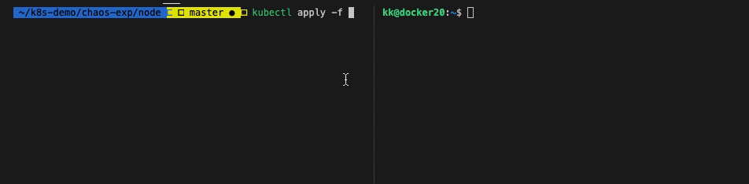
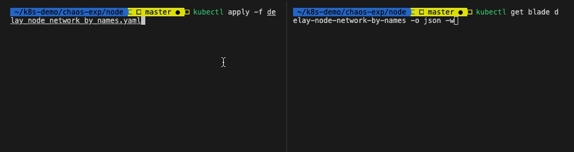
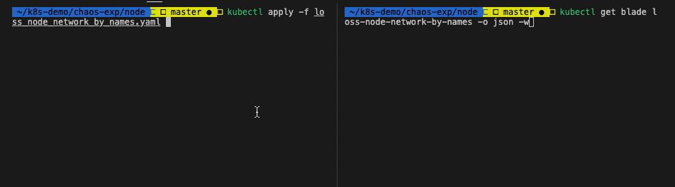
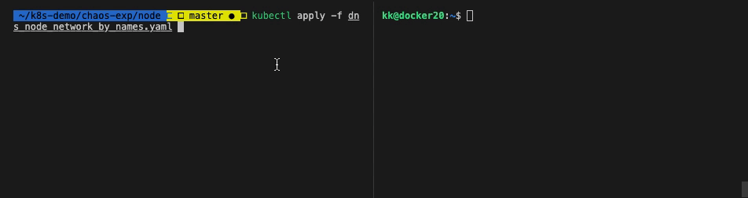
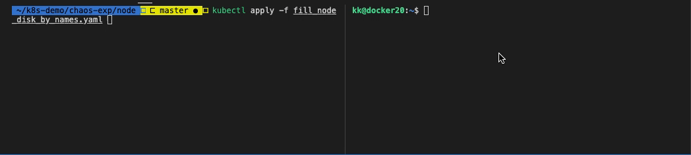
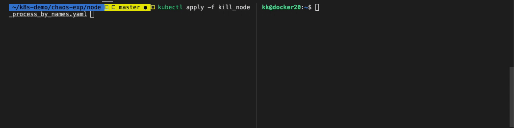
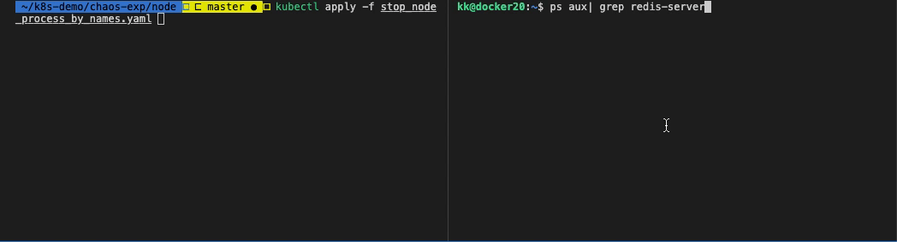

# Node 实验场景

- [节点 CPU 负载实验场景](node_cpu_load.yaml)
- 节点网络相关实验场景
  - [节点网络延迟场景](delay_node_network_by_names.yaml)
  - [节点网络丢包场景](loss_node_network_by_names.yaml)
  - [节点域名访问异常场景](dns_node_network_by_names.yaml)
- 节点磁盘相关场景
  - [节点磁盘填充场景](fill_node_disk_by_names.yaml)
  - [节点磁盘IO读写负载场景](burn_node_disk_by_names.yaml)
- 节点进程相关场景
  - [杀节点上指定进程](kill_node_process_by_names.yaml)
  - [挂起节点上指定进程](stop_node_process_by_names.yaml)

**参数**

node 资源均支持以下参数。

| 参数 | 类型 | 说明 | 默认值 |
| --- | --- | --- | --- |
| `evict-count` | string | 限制实验生效的数量 | |
| `evict-percent` | string | 限制实验生效数量的百分比，不包含 % | |
| `labels` | string | Pod 资源标签，多个标签之前是或的关系 | |
| `names` | string | Pod 资源名 | |
| `waiting-time` | string | 实验结果等待时间，参数值要包含单位，例如 10s，1m | 20s |

## 节点 CPU 负载实验场景

指定一个节点，做 CPU 负载 80% 实验。

**参数**

| 参数 | 类型 | 说明 |
| --- | --- | --- |
| `timeout` | string | 设定运行时长，单位是秒，通用参数 |
| `cpu-count` | string | 指定 CPU 满载的个数 |
| `cpu-list` | string | 指定 CPU 满载的具体核，核索引从 0 开始 (0-3 or 1,3) |
| `cpu-percent` | string | 指定 CPU 负载百分比，取值在 0-100 |

**开始实验**

选择一个节点，修改 `node_cpu_load.yaml` 中的 `names` 值。

执行命令，开始实验：

```bash
$ kubectl apply -f node_cpu_load.yaml
```

**查看实验状态**

执行 `kubectl get blade cpu-load -o json` 命令，查看实验状态：

```json
{
    "apiVersion": "chaosblade.io/v1alpha1",
    "kind": "ChaosBlade",
    "metadata": {
        "annotations": {
            "kubectl.kubernetes.io/last-applied-configuration": "{\"apiVersion\":\"chaosblade.io/v1alpha1\",\"kind\":\"ChaosBlade\",\"metadata\":{\"annotations\":{},\"name\":\"cpu-load\"},\"spec\":{\"experiments\":[{\"action\":\"fullload\",\"desc\":\"increase node cpu load by names\",\"matchers\":[{\"name\":\"names\",\"value\":[\"docker20\"]},{\"name\":\"cpu-percent\",\"value\":[\"80\"]}],\"scope\":\"node\",\"target\":\"cpu\"}]}}\n"
        },
        "creationTimestamp": "2020-06-08T02:14:04Z",
        "finalizers": [
            "finalizer.chaosblade.io"
        ],
        "generation": 1,
        "name": "cpu-load",
        "resourceVersion": "974292",
        "selfLink": "/apis/chaosblade.io/v1alpha1/chaosblades/cpu-load",
        "uid": "21a10bcb-a5ab-4c9e-834a-95599768490a"
    },
    "spec": {
        "experiments": [
            {
                "action": "fullload",
                "desc": "increase node cpu load by names",
                "matchers": [
                    {
                        "name": "names",
                        "value": [
                            "docker20"
                        ]
                    },
                    {
                        "name": "cpu-percent",
                        "value": [
                            "80"
                        ]
                    }
                ],
                "scope": "node",
                "target": "cpu"
            }
        ]
    },
    "status": {
        "expStatuses": [
            {
                "action": "fullload",
                "resStatuses": [
                    {
                        "id": "f5854d2a9b79cd79",
                        "kind": "node",
                        "name": "docker20",
                        "nodeName": "docker20",
                        "state": "Success",
                        "success": true,
                        "uid": "51d4553b-8da2-46ab-9b3d-51a11ae6d06f"
                    }
                ],
                "scope": "node",
                "state": "Success",
                "success": true,
                "target": "cpu"
            }
        ],
        "phase": "Running"
    }
}
```

**观测结果**



**停止实验**

执行命令：`kubectl delete -f node_cpu_load.yaml`

或者直接删除 blade 资源：`kubectl delete blade cpu-load`

## 节点网络相关实验场景

> 实验前，请先登录 node 节点，使用 `ifconfig` 命令查看网卡信息，不是所有系统默认的网卡名称都是 `eth0`。

### 节点网络延迟场景

docker20 节点的本地 32436 端口添加 3000 毫秒访问延迟，延迟时间上下浮动 1000 毫秒。

**实验参数**

| 参数 | 类型 | 说明 |
| --- | --- | --- |
| `destination-ip` | string | 目标 IP. 支持通过子网掩码来指定一个网段的IP地址, 例如 192.168.1.0/24. 则 192.168.1.0~192.168.1.255 都生效。你也可以指定固定的 IP，如 192.168.1.1 或者 192.168.1.1/32，也可以通过都号分隔多个参数，例如 192.168.1.1,192.168.2.1。 |
| `exclude-port` | string | 排除掉的端口，默认会忽略掉通信的对端端口，目的是保留通信可用。可以指定多个，使用逗号分隔或者连接符表示范围，例如 22,8000 或者 8000-8010。 这个参数不能与 --local-port 或者 --remote-port 参数一起使用。 |
| `exclude-ip` | string | 排除受影响的 IP，支持通过子网掩码来指定一个网段的IP地址, 例如 192.168.1.0/24. 则 192.168.1.0~192.168.1.255 都生效。你也可以指定固定的 IP，如 192.168.1.1 或者 192.168.1.1/32，也可以通过都号分隔多个参数，例如 192.168.1.1,192.168.2.1。 |
| `interface` | string | 网卡设备，例如 eth0 (必要参数)。 |
| `local-port` | string | 本地端口，一般是本机暴露服务的端口。可以指定多个，使用逗号分隔或者连接符表示范围，例如 80,8000-8080。 |
| `offset` | string | 延迟时间上下浮动的值, 单位是毫秒。 |
| `remote-port` | string | 远程端口，一般是要访问的外部暴露服务的端口。可以指定多个，使用逗号分隔或者连接符表示范围，例如 80,8000-8080。 |
| `time` | string | 延迟时间，单位是毫秒 (必要参数)。 |
| `force` |  | 强制覆盖已有的 tc 规则，请务必在明确之前的规则可覆盖的情况下使用。 |
| `ignore-peer-port` |  | 针对添加 --exclude-port 参数，报 ss 命令找不到的情况下使用，忽略排除端口。 |
| `timeout` | string | 设定运行时长，单位是秒，通用参数。 |

**开始实验**

选择一个节点，修改 `delay_node_network_by_names.yaml` 中的 `names` 值。

对 docker20 节点本地端口 32436 访问丢包率 100%。

执行命令，开始实验：

```bash
$ kubectl apply -f delay_node_network_by_names.yaml
```

**查看实验状态**

执行 `kubectl get blade delay-node-network-by-names -o json` 命令，查看实验状态：

```json
{
    "apiVersion": "chaosblade.io/v1alpha1",
    "kind": "ChaosBlade",
    "metadata": {
        "annotations": {
            "kubectl.kubernetes.io/last-applied-configuration": "{\"apiVersion\":\"chaosblade.io/v1alpha1\",\"kind\":\"ChaosBlade\",\"metadata\":{\"annotations\":{},\"name\":\"delay-node-network-by-names\"},\"spec\":{\"experiments\":[{\"action\":\"delay\",\"desc\":\"delay node network loss\",\"matchers\":[{\"name\":\"names\",\"value\":[\"docker20\"]},{\"name\":\"interface\",\"value\":[\"ens33\"]},{\"name\":\"local-port\",\"value\":[\"32436\"]},{\"name\":\"time\",\"value\":[\"3000\"]},{\"name\":\"offset\",\"value\":[\"1000\"]}],\"scope\":\"node\",\"target\":\"network\"}]}}\n"
        },
        "creationTimestamp": "2020-06-08T03:28:30Z",
        "finalizers": [
            "finalizer.chaosblade.io"
        ],
        "generation": 1,
        "name": "delay-node-network-by-names",
        "resourceVersion": "985238",
        "selfLink": "/apis/chaosblade.io/v1alpha1/chaosblades/delay-node-network-by-names",
        "uid": "d6cf9ba1-56e3-474c-89f3-1df89696c250"
    },
    "spec": {
        "experiments": [
            {
                "action": "delay",
                "desc": "delay node network loss",
                "matchers": [
                    {
                        "name": "names",
                        "value": [
                            "docker20"
                        ]
                    },
                    {
                        "name": "interface",
                        "value": [
                            "ens33"
                        ]
                    },
                    {
                        "name": "local-port",
                        "value": [
                            "32436"
                        ]
                    },
                    {
                        "name": "time",
                        "value": [
                            "3000"
                        ]
                    },
                    {
                        "name": "offset",
                        "value": [
                            "1000"
                        ]
                    }
                ],
                "scope": "node",
                "target": "network"
            }
        ]
    },
    "status": {
        "expStatuses": [
            {
                "action": "delay",
                "resStatuses": [
                    {
                        "id": "33c2ed6fec6fe8cc",
                        "kind": "node",
                        "name": "docker20",
                        "nodeName": "docker20",
                        "state": "Success",
                        "success": true,
                        "uid": "51d4553b-8da2-46ab-9b3d-51a11ae6d06f"
                    }
                ],
                "scope": "node",
                "state": "Success",
                "success": true,
                "target": "network"
            }
        ],
        "phase": "Running"
    }
}
```

**观测结果**

```bash
# 从实验节点访问 Guestbook
$ time echo "" | telnet 192.168.1.129 32436
Trying 192.168.1.129...
Connected to 192.168.1.129.
Escape character is '^]'.
Connection closed by foreign host.
echo ""  0.00s user 0.00s system 35% cpu 0.003 total
telnet 192.168.1.129 32436  0.01s user 0.00s system 0% cpu 3.248 total
```



**停止实验**

执行命令：`kubectl delete -f delay_node_network_by_names.yaml`

或者直接删除 blade 资源：`kubectl delete blade delay-node-network-by-names`

### 节点网络丢包场景

**实验参数**

| 参数 | 类型 | 说明 |
| --- | --- | --- |
| `destination-ip` | string | 目标 IP. 支持通过子网掩码来指定一个网段的IP地址, 例如 192.168.1.0/24. 则 192.168.1.0~192.168.1.255 都生效。你也可以指定固定的 IP，如 192.168.1.1 或者 192.168.1.1/32，也可以通过都号分隔多个参数，例如 192.168.1.1,192.168.2.1。 |
| `exclude-port` | string | 排除掉的端口，默认会忽略掉通信的对端端口，目的是保留通信可用。可以指定多个，使用逗号分隔或者连接符表示范围，例如 22,8000 或者 8000-8010。 这个参数不能与 --local-port 或者 --remote-port 参数一起使用。 |
| `exclude-ip` | string | 排除受影响的 IP，支持通过子网掩码来指定一个网段的IP地址, 例如 192.168.1.0/24. 则 192.168.1.0~192.168.1.255 都生效。你也可以指定固定的 IP，如 192.168.1.1 或者 192.168.1.1/32，也可以通过都号分隔多个参数，例如 192.168.1.1,192.168.2.1。 |
| `interface` | string | 网卡设备，例如 eth0 (必要参数)。 |
| `local-port` | string | 本地端口，一般是本机暴露服务的端口。可以指定多个，使用逗号分隔或者连接符表示范围，例如 80,8000-8080。 |
| `percent` | string | 丢包百分比，取值在[0, 100]的正整数 (必要参数)。 |
| `remote-port` | string | 远程端口，一般是要访问的外部暴露服务的端口。可以指定多个，使用逗号分隔或者连接符表示范围，例如 80,8000-8080。 |
| `force` |  | 强制覆盖已有的 tc 规则，请务必在明确之前的规则可覆盖的情况下使用。 |
| `ignore-peer-port` |  | 针对添加 --exclude-port 参数，报 ss 命令找不到的情况下使用，忽略排除端口。 |
| `timeout` | string | 设定运行时长，单位是秒，通用参数。 |

**开始实验**

选择一个节点，修改 `loss_node_network_by_names.yaml` 中的 `names` 值。

执行命令，开始实验：

```bash
$ kubectl apply -f loss_node_network_by_names.yaml
```

**查看实验状态**

执行 `kubectl get blade loss-node-network-by-names -o json` 命令，查看实验状态：

```json
{
    "apiVersion": "chaosblade.io/v1alpha1",
    "kind": "ChaosBlade",
    "metadata": {
        "annotations": {
            "kubectl.kubernetes.io/last-applied-configuration": "{\"apiVersion\":\"chaosblade.io/v1alpha1\",\"kind\":\"ChaosBlade\",\"metadata\":{\"annotations\":{},\"name\":\"loss-node-network-by-names\"},\"spec\":{\"experiments\":[{\"action\":\"loss\",\"desc\":\"node network loss\",\"matchers\":[{\"name\":\"names\",\"value\":[\"docker20\"]},{\"name\":\"percent\",\"value\":[\"100\"]},{\"name\":\"interface\",\"value\":[\"ens33\"]},{\"name\":\"local-port\",\"value\":[\"32436\"]}],\"scope\":\"node\",\"target\":\"network\"}]}}\n"
        },
        "creationTimestamp": "2020-06-08T02:41:56Z",
        "finalizers": [
            "finalizer.chaosblade.io"
        ],
        "generation": 1,
        "name": "loss-node-network-by-names",
        "resourceVersion": "978403",
        "selfLink": "/apis/chaosblade.io/v1alpha1/chaosblades/loss-node-network-by-names",
        "uid": "5322e39a-a0ab-4521-a931-e57040344076"
    },
    "spec": {
        "experiments": [
            {
                "action": "loss",
                "desc": "node network loss",
                "matchers": [
                    {
                        "name": "names",
                        "value": [
                            "docker20"
                        ]
                    },
                    {
                        "name": "percent",
                        "value": [
                            "100"
                        ]
                    },
                    {
                        "name": "interface",
                        "value": [
                            "ens33"
                        ]
                    },
                    {
                        "name": "local-port",
                        "value": [
                            "32436"
                        ]
                    }
                ],
                "scope": "node",
                "target": "network"
            }
        ]
    },
    "status": {
        "expStatuses": [
            {
                "action": "loss",
                "resStatuses": [
                    {
                        "id": "b93929d018091e18",
                        "kind": "node",
                        "name": "docker20",
                        "nodeName": "docker20",
                        "state": "Success",
                        "success": true,
                        "uid": "51d4553b-8da2-46ab-9b3d-51a11ae6d06f"
                    }
                ],
                "scope": "node",
                "state": "Success",
                "success": true,
                "target": "network"
            }
        ],
        "phase": "Running"
    }
}
```

**观测结果**

该端口为 `Guestbook` nodeport 的端口，访问实验端口无响应，但是访问未开启实验的端口可以正常使用



```bash
# 获取节点 IP
$ kubectl get node -o wide
NAME       STATUS   ROLES                      AGE     VERSION   INTERNAL-IP     EXTERNAL-IP   OS-IMAGE             KERNEL-VERSION       CONTAINER-RUNTIME
docker20   Ready    worker                     3d16h   v1.17.6   192.168.1.129   <none>        Ubuntu 18.04.4 LTS   4.15.0-101-generic   docker://19.3.11
kk         Ready    controlplane,etcd,worker   4d16h   v1.17.6   192.168.4.210   <none>        Ubuntu 18.04.4 LTS   4.15.0-101-generic   docker://19.3.11
# 从实验节点访问 Guestbook - 无法访问
$ telnet 192.168.1.129 32436
Trying 192.168.1.129...
telnet: connect to address 192.168.1.129: Operation timed out
telnet: Unable to connect to remote host
# 从非实验节点访问 Guestbook - 正常访问
$ telnet 192.168.4.210 32436
Trying 192.168.4.210...
Connected to 192.168.4.210.
Escape character is '^]'.
```

同样也可以直接从浏览器访问地址，验证实验。

**停止实验**

执行命令：`kubectl delete -f loss_node_network_by_names.yaml`

或者直接删除 blade 资源：`kubectl delete blade loss-node-network-by-names`

### 节点域名访问异常场景

本实验通过修改 Node 的 hosts，篡改域名地址映射，模拟 Pod 内域名访问异常场景。

**实验参数**

| 参数 | 类型 | 说明 |
| --- | --- | --- |
| `domain` | string | 域名 (必要参数) |
| `ip` | string | 映射的 ip (必要参数) |
| `timeout` | string | 设定运行时长，单位是秒，通用参数。 |

**开始实验**

选择一个节点，修改 `dns_node_network_by_names.yaml` 中的 `names` 值。

执行命令，开始实验：

```bash
$ kubectl apply -f dns_node_network_by_names.yaml
```

**查看实验状态**

执行 `kubectl get blade dns-node-network-by-names -o json` 命令，查看实验状态：

```json
{
    "apiVersion": "chaosblade.io/v1alpha1",
    "kind": "ChaosBlade",
    "metadata": {
        "annotations": {
            "kubectl.kubernetes.io/last-applied-configuration": "{\"apiVersion\":\"chaosblade.io/v1alpha1\",\"kind\":\"ChaosBlade\",\"metadata\":{\"annotations\":{},\"name\":\"dns-node-network-by-names\"},\"spec\":{\"experiments\":[{\"action\":\"dns\",\"desc\":\"dns node network by names\",\"matchers\":[{\"name\":\"names\",\"value\":[\"docker20\"]},{\"name\":\"domain\",\"value\":[\"www.baidu.com\"]},{\"name\":\"ip\",\"value\":[\"10.0.0.1\"]}],\"scope\":\"node\",\"target\":\"network\"}]}}\n"
        },
        "creationTimestamp": "2020-06-08T03:39:54Z",
        "finalizers": [
            "finalizer.chaosblade.io"
        ],
        "generation": 1,
        "name": "dns-node-network-by-names",
        "resourceVersion": "986912",
        "selfLink": "/apis/chaosblade.io/v1alpha1/chaosblades/dns-node-network-by-names",
        "uid": "dd6fa6bc-e04a-4566-b949-4630ed94b1c2"
    },
    "spec": {
        "experiments": [
            {
                "action": "dns",
                "desc": "dns node network by names",
                "matchers": [
                    {
                        "name": "names",
                        "value": [
                            "docker20"
                        ]
                    },
                    {
                        "name": "domain",
                        "value": [
                            "www.baidu.com"
                        ]
                    },
                    {
                        "name": "ip",
                        "value": [
                            "10.0.0.1"
                        ]
                    }
                ],
                "scope": "node",
                "target": "network"
            }
        ]
    },
    "status": {
        "expStatuses": [
            {
                "action": "dns",
                "resStatuses": [
                    {
                        "id": "626da6fac3f157a5",
                        "kind": "node",
                        "name": "docker20",
                        "nodeName": "docker20",
                        "state": "Success",
                        "success": true,
                        "uid": "51d4553b-8da2-46ab-9b3d-51a11ae6d06f"
                    }
                ],
                "scope": "node",
                "state": "Success",
                "success": true,
                "target": "network"
            }
        ],
        "phase": "Running"
    }
}
```

**观测结果**

```bash
# 进入实验 node
$ ssh kk@192.168.1.129
# Ping www.baidu.com
$ ping www.baidu.com
# 无响应
```



可以看到 Node 的 `/etc/hosts` 文件被修改，模拟了 dns 解析异常的场景。

**停止实验**

执行命令：`kubectl delete -f dns_node_network_by_names.yaml`

或者直接删除 blade 资源：`kubectl delete blade dns-node-network-by-names`

## 节点磁盘相关场景

kubernetes 节点磁盘场景。

### 节点磁盘填充场景

指定节点磁盘占用 80%

**参数**

节点磁盘填充均支持以下参数。

| 参数 | 类型 | 说明 | 默认值 |
| --- | --- | --- | --- |
| `path` | string | 需要填充的目录 | `/` |
| `size` | string | 需要填充的文件大小，单位是 M，取值是整数，例如 --size 1024 | |
| `reserve` | string | 保留磁盘大小，单位是MB。取值是不包含单位的正整数，例如 --reserve 1024。如果 size、percent、reserve 参数都存在，优先级是 percent > reserve > size | |
| `percent` | string | 指定磁盘使用率，取值是不带%号的正整数，例如 --percent 80 | |
| `retain-handle` |  | 是否保留填充|  |
| `timeout` | string | 设定运行时长，单位是秒，通用参数 | |

**开始实验**

选择一个节点，修改 `fill_node_disk_by_names.yaml` 中的 `names` 值。

执行命令，开始实验：

```bash
$ kubectl apply -f fill_node_disk_by_names.yaml
```

**查看实验状态**

执行 `kubectl get blade fill-node-disk-by-names -o json` 命令，查看实验状态：

```json
{
    "apiVersion": "chaosblade.io/v1alpha1",
    "kind": "ChaosBlade",
    "metadata": {
        "annotations": {
            "kubectl.kubernetes.io/last-applied-configuration": "{\"apiVersion\":\"chaosblade.io/v1alpha1\",\"kind\":\"ChaosBlade\",\"metadata\":{\"annotations\":{},\"name\":\"fill-node-disk-by-names\"},\"spec\":{\"experiments\":[{\"action\":\"fill\",\"desc\":\"node disk fill\",\"matchers\":[{\"name\":\"names\",\"value\":[\"docker20\"]},{\"name\":\"percent\",\"value\":[\"80\"]}],\"scope\":\"node\",\"target\":\"disk\"}]}}\n"
        },
        "creationTimestamp": "2020-06-08T03:57:46Z",
        "finalizers": [
            "finalizer.chaosblade.io"
        ],
        "generation": 1,
        "name": "fill-node-disk-by-names",
        "resourceVersion": "989523",
        "selfLink": "/apis/chaosblade.io/v1alpha1/chaosblades/fill-node-disk-by-names",
        "uid": "7afd5214-47ee-4048-a6ff-34ac6fd45ff3"
    },
    "spec": {
        "experiments": [
            {
                "action": "fill",
                "desc": "node disk fill",
                "matchers": [
                    {
                        "name": "names",
                        "value": [
                            "docker20"
                        ]
                    },
                    {
                        "name": "percent",
                        "value": [
                            "80"
                        ]
                    }
                ],
                "scope": "node",
                "target": "disk"
            }
        ]
    },
    "status": {
        "expStatuses": [
            {
                "action": "fill",
                "resStatuses": [
                    {
                        "id": "6c155cf5627c699a",
                        "kind": "node",
                        "name": "docker20",
                        "nodeName": "docker20",
                        "state": "Success",
                        "success": true,
                        "uid": "51d4553b-8da2-46ab-9b3d-51a11ae6d06f"
                    }
                ],
                "scope": "node",
                "state": "Success",
                "success": true,
                "target": "disk"
            }
        ],
        "phase": "Running"
    }
}
```

**观测结果**

可以看到磁盘占用 80%。

```bash
# 进入实验 node
$ ssh kk@192.168.1.129
# 查看磁盘使用率
$ df -h
Filesystem      Size  Used Avail Use% Mounted on
udev            7.9G     0  7.9G   0% /dev
tmpfs           1.6G  2.2M  1.6G   1% /run
/dev/sda2        98G   73G   20G  79% /
tmpfs           7.9G     0  7.9G   0% /dev/shm
tmpfs           5.0M     0  5.0M   0% /run/lock
tmpfs           7.9G     0  7.9G   0% /sys/fs/cgroup
/dev/loop1       90M   90M     0 100% /snap/core/8268
tmpfs           1.6G     0  1.6G   0% /run/user/1000
/dev/loop0       98M   98M     0 100% /snap/core/9289
```



**停止实验**

执行命令：`kubectl delete -f fill_node_disk_by_names.yaml`

或者直接删除 blade 资源：`kubectl delete blade fill-node-disk-by-names`

### 节点磁盘IO读写负载场景

**参数**

节点磁盘填充均支持以下参数。

| 参数 | 类型 | 说明 | 默认值 |
| --- | --- | --- | --- |
| `path` | string | 需要填充的目录 | `/` |
| `read` | | 触发提升磁盘读 IO 负载，会创建 600M 的文件用于读，销毁实验会自动删除 | |
| `size` | string | 块大小, 单位是 M, 默认值是 10，一般不需要修改，除非想更大的提高 io 负载 | |
| `timeout` | string | 设定运行时长，单位是秒，通用参数 | |
| `write` | | 触发提升磁盘写 IO 负载，会根据块大小的值来写入一个文件，比如块大小是 10，则固定的块的数量是 100，则会创建 1000M 的文件，销毁实验会自动删除 | |

**开始实验**

选择一个节点，修改 `burn_node_disk_by_names.yaml` 中的 `names` 值。

执行命令，开始实验：

```bash
$ kubectl apply -f burn_node_disk_by_names.yaml
```

**查看实验状态**

执行 `kubectl get blade burn-node-disk-by-names -o json` 命令，查看实验状态：

```json

```

**观测结果**

```bash

```

**停止实验**

执行命令：`kubectl delete -f burn_node_disk_by_names.yaml`

或者直接删除 blade 资源：`kubectl delete blade burn-node-disk-by-names`

## 节点进程相关场景

kubernetes 节点进程相关场景。

### 杀节点上指定进程

此实验会删除指定节点上的 `redis-server` 进程。

**参数**

| 参数 | 类型 | 说明 |
| --- | --- | --- |
| `process` | string | 进程关键词，会在整个命令行中查找 |
| `process-cmd` | string | 进程命令，只会在命令中查找 |
| `count` | string | 限制杀掉进程的数量，0 表示无限制 |
| `signal` | string | 指定杀进程的信号量，默认是 9，例如 --signal 15 |
| `timeout` | string | 设定运行时长，单位是秒，通用参数|

**开始实验**

选择一个节点，修改 `kill_node_process_by_names.yaml` 中的 `names` 值。

执行命令，开始实验：

```bash
$ kubectl apply -f kill_node_process_by_names.yaml
```

**查看实验状态**

执行 `kubectl get blade kill-node-process-by-names -o json` 命令，查看实验状态：

```json
{
    "apiVersion": "chaosblade.io/v1alpha1",
    "kind": "ChaosBlade",
    "metadata": {
        "annotations": {
            "kubectl.kubernetes.io/last-applied-configuration": "{\"apiVersion\":\"chaosblade.io/v1alpha1\",\"kind\":\"ChaosBlade\",\"metadata\":{\"annotations\":{},\"name\":\"kill-node-process-by-names\"},\"spec\":{\"experiments\":[{\"action\":\"kill\",\"desc\":\"kill node process by names\",\"matchers\":[{\"name\":\"names\",\"value\":[\"docker20\"]},{\"name\":\"process\",\"value\":[\"redis-server\"]}],\"scope\":\"node\",\"target\":\"process\"}]}}\n"
        },
        "creationTimestamp": "2020-06-08T06:23:30Z",
        "finalizers": [
            "finalizer.chaosblade.io"
        ],
        "generation": 1,
        "name": "kill-node-process-by-names",
        "resourceVersion": "1010910",
        "selfLink": "/apis/chaosblade.io/v1alpha1/chaosblades/kill-node-process-by-names",
        "uid": "e6120a54-bfc3-44ab-9225-01b77e0b89d0"
    },
    "spec": {
        "experiments": [
            {
                "action": "kill",
                "desc": "kill node process by names",
                "matchers": [
                    {
                        "name": "names",
                        "value": [
                            "docker20"
                        ]
                    },
                    {
                        "name": "process",
                        "value": [
                            "redis-server"
                        ]
                    }
                ],
                "scope": "node",
                "target": "process"
            }
        ]
    },
    "status": {
        "expStatuses": [
            {
                "action": "kill",
                "resStatuses": [
                    {
                        "id": "61921300c4eefa75",
                        "kind": "node",
                        "name": "docker20",
                        "nodeName": "docker20",
                        "state": "Success",
                        "success": true,
                        "uid": "51d4553b-8da2-46ab-9b3d-51a11ae6d06f"
                    }
                ],
                "scope": "node",
                "state": "Success",
                "success": true,
                "target": "process"
            }
        ],
        "phase": "Running"
    }
}
```

**观测结果**

```bash
# 进入实验 node
$ ssh kk@192.168.1.129
# 查看 redis-server 进程号
$ ps -ef | grep redis-server
root     31327 31326  0 06:15 ?        00:00:00 redis-server *:6379
# 可以看到进程号发生了变化
$ ps -ef | grep redis-server
root      2873  2872  0 06:23 ?        00:00:00 redis-server *:6379
```

`redis-server` 的进程号发生改变，说明被杀掉后，又被重新拉起。



**停止实验**

执行命令：`kubectl delete -f kill_node_process_by_names.yaml`

或者直接删除 blade 资源：`kubectl delete blade kill-node-process-by-names`

### 挂起节点上指定进程

此实验会挂起指定节点上的 `redis-server` 进程。

**参数**

| 参数 | 类型 | 说明 |
| --- | --- | --- |
| `process` | string | 进程关键词，会在整个命令行中查找 |
| `process-cmd` | string | 进程命令，只会在命令中查找 |
| `timeout` | string | 设定运行时长，单位是秒，通用参数|

**开始实验**

选择一个节点，修改 `stop_node_process_by_names.yaml` 中的 `names` 值。

执行命令，开始实验：

```bash
$ kubectl apply -f stop_node_process_by_names.yaml
```

**查看实验状态**

执行 `kubectl get blade stop-node-process-by-names -o json` 命令，查看实验状态：

```json
{
    "apiVersion": "chaosblade.io/v1alpha1",
    "kind": "ChaosBlade",
    "metadata": {
        "annotations": {
            "kubectl.kubernetes.io/last-applied-configuration": "{\"apiVersion\":\"chaosblade.io/v1alpha1\",\"kind\":\"ChaosBlade\",\"metadata\":{\"annotations\":{},\"name\":\"stop-node-process-by-names\"},\"spec\":{\"experiments\":[{\"action\":\"stop\",\"desc\":\"kill node process by names\",\"matchers\":[{\"name\":\"names\",\"value\":[\"docker20\"]},{\"name\":\"process\",\"value\":[\"redis-server\"]}],\"scope\":\"node\",\"target\":\"process\"}]}}\n"
        },
        "creationTimestamp": "2020-06-08T08:20:36Z",
        "finalizers": [
            "finalizer.chaosblade.io"
        ],
        "generation": 1,
        "name": "stop-node-process-by-names",
        "resourceVersion": "1028075",
        "selfLink": "/apis/chaosblade.io/v1alpha1/chaosblades/stop-node-process-by-names",
        "uid": "40ebc6e6-4e2f-45dc-9a62-dc60527a1f4f"
    },
    "spec": {
        "experiments": [
            {
                "action": "stop",
                "desc": "kill node process by names",
                "matchers": [
                    {
                        "name": "names",
                        "value": [
                            "docker20"
                        ]
                    },
                    {
                        "name": "process",
                        "value": [
                            "redis-server"
                        ]
                    }
                ],
                "scope": "node",
                "target": "process"
            }
        ]
    },
    "status": {
        "expStatuses": [
            {
                "action": "stop",
                "resStatuses": [
                    {
                        "id": "e71f0902c13f2de1",
                        "kind": "node",
                        "name": "docker20",
                        "nodeName": "docker20",
                        "state": "Success",
                        "success": true,
                        "uid": "51d4553b-8da2-46ab-9b3d-51a11ae6d06f"
                    }
                ],
                "scope": "node",
                "state": "Success",
                "success": true,
                "target": "process"
            }
        ],
        "phase": "Running"
    }
}
```

**观测结果**

```bash
# 进入实验 node
$ ssh kk@192.168.1.129
# 查看 redis-server 进程号
$ ps aux| grep redis-server
root      5632  0.0  0.0  41520  4168 ?        Tl   06:28   0:06 redis-server *:6379
```

可以看到 `redis-server` 此刻进程处于暂停状态了（T）。



**停止实验**

执行命令：`kubectl delete -f stop_node_process_by_names.yaml`

或者直接删除 blade 资源：`kubectl delete blade stop-node-process-by-names`
