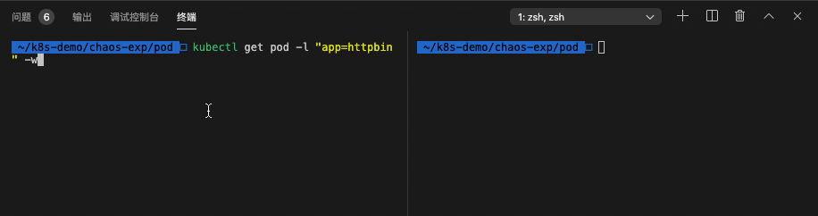
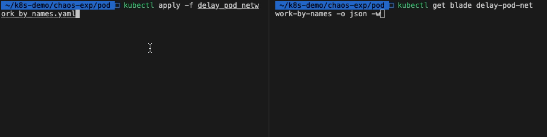
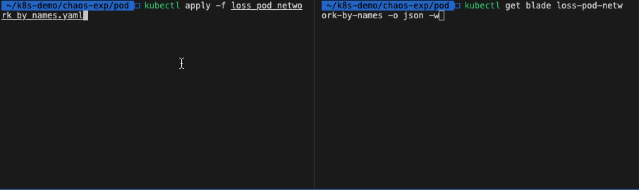
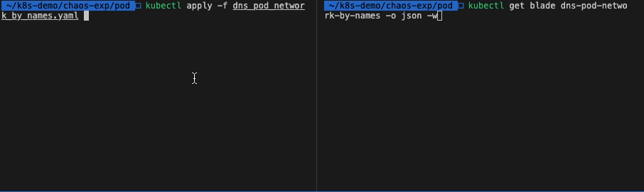
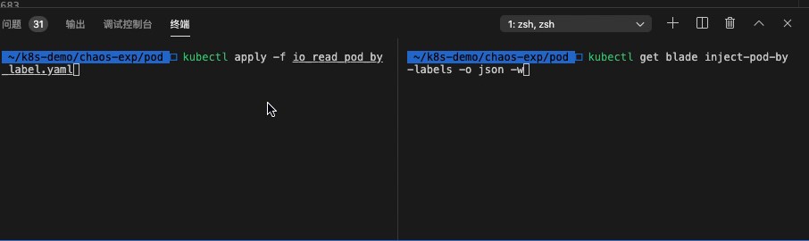

# Pod 实验场景

>值得注意的是：在实验途中，如果被实验的 Pod 被删除了，则会导致实验销毁失败，实验无法被销毁。这样设计的目的是为了在销毁失败的实验时，用户需要去检查是否真正的需要销毁。确认无误后，可以强制销毁该实验，详见 https://github.com/chaosblade-io/chaosblade/issues/368。

- Pod 资源自身场景
  - [删除 POD](delete_pod_by_labels.yaml)
- Pod 网络相关场
  - [Pod 网络延迟场景](delay_pod_network_by_names.yaml)
  - [Pod 网络丢包场景](loss_pod_network_by_names.yaml)
  - [Pod 域名访问异常场景](dns_pod_network_by_names.yaml)
  - [Pod 文件系统I/O故障](pod_io.yaml)

**参数**

Pod 资源均支持以下参数。

| 参数 | 类型 | 说明 | 默认值 |
| --- | --- | --- | --- |
| `namespace` | string | Pod 所属的命名空间 | default |
| `evict-count` | string | 限制实验生效的数量 | |
| `evict-percent` | string | 限制实验生效数量的百分比，不包含 % | |
| `labels` | string | Pod 资源标签，多个标签之前是或的关系 | |
| `names` | string | Pod 资源名 | |
| `waiting-time` | string | 实验结果等待时间，参数值要包含单位，例如 10s，1m | 20s |

## Pod 资源自身场景

### 删除 Pod

删除 default 命名空间下标签是 `app=httpbin` 的 pod。

**执行观测**

开始观察需要删除的 pod：

```bash
kubectl get pod -l "app=httpbin" -w
```

**开始实验**

新建终端，并开始实验：

```bash
kubectl apply -f delete_pod_by_labels.yaml
```

**查看实验状态**

执行命令：`kubectl get blade delete-two-pod-by-labels -o json`，查看实验状态：

```json
{
    "apiVersion": "chaosblade.io/v1alpha1",
    "kind": "ChaosBlade",
    "metadata": {
        "annotations": {
            "kubectl.kubernetes.io/last-applied-configuration": "{\"apiVersion\":\"chaosblade.io/v1alpha1\",\"kind\":\"ChaosBlade\",\"metadata\":{\"annotations\":{},\"name\":\"delete-two-pod-by-labels\"},\"spec\":{\"experiments\":[{\"action\":\"delete\",\"desc\":\"delete pod by labels\",\"matchers\":[{\"name\":\"labels\",\"value\":[\"app=httpbin\"]},{\"name\":\"namespace\",\"value\":[\"default\"]},{\"name\":\"evict-count\",\"value\":[\"2\"]}],\"scope\":\"pod\",\"target\":\"pod\"}]}}\n"
        },
        "creationTimestamp": "2020-06-01T02:11:36Z",
        "finalizers": [
            "finalizer.chaosblade.io"
        ],
        "generation": 1,
        "name": "delete-two-pod-by-labels",
        "resourceVersion": "10139772",
        "selfLink": "/apis/chaosblade.io/v1alpha1/chaosblades/delete-two-pod-by-labels",
        "uid": "5eec72c7-b52b-4c35-a3b4-e6f6772f496b"
    },
    "spec": {
        "experiments": [
            {
                "action": "delete",
                "desc": "delete pod by labels",
                "matchers": [
                    {
                        "name": "labels",
                        "value": [
                            "app=httpbin"
                        ]
                    },
                    {
                        "name": "namespace",
                        "value": [
                            "default"
                        ]
                    },
                    {
                        "name": "evict-count",
                        "value": [
                            "2"
                        ]
                    }
                ],
                "scope": "pod",
                "target": "pod"
            }
        ]
    },
    "status": {
        "expStatuses": [
            {
                "action": "delete",
                "resStatuses": [
                    {
                        "kind": "pod",
                        "name": "httpbin-8488c84bb7-w5gzl",
                        "nodeName": "keking",
                        "state": "Success",
                        "success": true,
                        "uid": "b61981d7-f1f8-43a7-885f-d2db012f7647"
                    }
                ],
                "scope": "pod",
                "state": "Success",
                "success": true,
                "target": "pod"
            }
        ],
        "phase": "Running"
    }
}
```

**查看实验结果**



**停止实验**

执行命令：`kubectl delete -f delete_pod_by_labels.yaml`

或者直接删除 blade 资源：`kubectl delete blade delete-two-pod-by-labels`

## Pod 网络相关场景

### Pod 网络延迟场景

对 chaosblade 命名空间中，对 `redis-master-68857cd57c-dzbs9` Pod 的本地 6379 端口添加 3000 毫秒访问延迟，延迟时间上下浮动 1000 毫秒。

**实验参数**

| 参数 | 类型 | 说明 |
| --- | --- | --- |
| `destination-ip` | string | 目标 IP. 支持通过子网掩码来指定一个网段的IP地址, 例如 192.168.1.0/24. 则 192.168.1.0~192.168.1.255 都生效。你也可以指定固定的 IP，如 192.168.1.1 或者 192.168.1.1/32，也可以通过都号分隔多个参数，例如 192.168.1.1,192.168.2.1。 |
| `exclude-port` | string | 排除掉的端口，默认会忽略掉通信的对端端口，目的是保留通信可用。可以指定多个，使用逗号分隔或者连接符表示范围，例如 22,8000 或者 8000-8010。 这个参数不能与 --local-port 或者 --remote-port 参数一起使用。 |
| `exclude-ip` | string | 排除受影响的 IP，支持通过子网掩码来指定一个网段的IP地址, 例如 192.168.1.0/24. 则 192.168.1.0~192.168.1.255 都生效。你也可以指定固定的 IP，如 192.168.1.1 或者 192.168.1.1/32，也可以通过都号分隔多个参数，例如 192.168.1.1,192.168.2.1。 |
| `interface` | string | 网卡设备，例如 eth0 (必要参数)。 |
| `local-port` | string | 本地端口，一般是本机暴露服务的端口。可以指定多个，使用逗号分隔或者连接符表示范围，例如 80,8000-8080。 |
| `offset` | string | 延迟时间上下浮动的值, 单位是毫秒。 |
| `remote-port` | string | 远程端口，一般是要访问的外部暴露服务的端口。可以指定多个，使用逗号分隔或者连接符表示范围，例如 80,8000-8080。 |
| `time` | string | 延迟时间，单位是毫秒 (必要参数)。 |
| `force` |  | 强制覆盖已有的 tc 规则，请务必在明确之前的规则可覆盖的情况下使用。 |
| `ignore-peer-port` |  | 针对添加 --exclude-port 参数，报 ss 命令找不到的情况下使用，忽略排除端口。 |
| `timeout` | string | 设定运行时长，单位是秒，通用参数。 |

**开始实验**

获取 Pod 名称：

```bash
$ kubectl get pod -l app=redis,role=master -o jsonpath={.items..metadata.name}
```

修改 `delay_pod_network_by_names.yaml` 中的 `spec`->`experiments`->`scope`->`matchers`->`name`->`value`

执行命令，开始实验：

```bash
$ kubectl apply -f delay_pod_network_by_names.yaml
```

**查看实验状态**

执行 `kubectl get blade delay-pod-network-by-names -o json` 命令，查看实验状态：

```json
{
    "apiVersion": "chaosblade.io/v1alpha1",
    "kind": "ChaosBlade",
    "metadata": {
        "annotations": {
            "kubectl.kubernetes.io/last-applied-configuration": "{\"apiVersion\":\"chaosblade.io/v1alpha1\",\"kind\":\"ChaosBlade\",\"metadata\":{\"annotations\":{},\"name\":\"delay-pod-network-by-names\"},\"spec\":{\"experiments\":[{\"action\":\"delay\",\"desc\":\"delay pod network by names\",\"matchers\":[{\"name\":\"names\",\"value\":[\"redis-master-68857cd57c-dzbs9\"]},{\"name\":\"namespace\",\"value\":[\"chaosblade\"]},{\"name\":\"local-port\",\"value\":[\"6379\"]},{\"name\":\"interface\",\"value\":[\"eth0\"]},{\"name\":\"time\",\"value\":[\"3000\"]},{\"name\":\"offset\",\"value\":[\"1000\"]}],\"scope\":\"pod\",\"target\":\"network\"}]}}\n"
        },
        "creationTimestamp": "2020-06-02T05:57:50Z",
        "finalizers": [
            "finalizer.chaosblade.io"
        ],
        "generation": 1,
        "name": "delay-pod-network-by-names",
        "resourceVersion": "7710394",
        "selfLink": "/apis/chaosblade.io/v1alpha1/chaosblades/delay-pod-network-by-names",
        "uid": "1235ff55-8256-4caa-a371-e1abf6c9e7b7"
    },
    "spec": {
        "experiments": [
            {
                "action": "delay",
                "desc": "delay pod network by names",
                "matchers": [
                    {
                        "name": "names",
                        "value": [
                            "redis-master-68857cd57c-dzbs9"
                        ]
                    },
                    {
                        "name": "namespace",
                        "value": [
                            "chaosblade"
                        ]
                    },
                    {
                        "name": "local-port",
                        "value": [
                            "6379"
                        ]
                    },
                    {
                        "name": "interface",
                        "value": [
                            "eth0"
                        ]
                    },
                    {
                        "name": "time",
                        "value": [
                            "3000"
                        ]
                    },
                    {
                        "name": "offset",
                        "value": [
                            "1000"
                        ]
                    }
                ],
                "scope": "pod",
                "target": "network"
            }
        ]
    },
    "status": {
        "expStatuses": [
            {
                "action": "delay",
                "resStatuses": [
                    {
                        "id": "a86f8cf8b68ace98",
                        "kind": "pod",
                        "name": "redis-master",
                        "nodeName": "keking",
                        "state": "Success",
                        "success": true,
                        "uid": "619a19ceb213f9b6152159bd868e88de2ddbf9a8aac606dc274b34bec6510c60"
                    }
                ],
                "scope": "pod",
                "state": "Success",
                "success": true,
                "target": "network"
            }
        ],
        "phase": "Running"
    }
}
```

**观测结果**

```bash
# 获取实验 pod ip
$ kubectl get pod -l app=redis,role=master -o jsonpath={.items..status.podIP}
10.42.69.44
# 进入观测 pod
$ kubectl exec -it redis-slave-6dd975d4c8-2zrkb bash
# 在 pod 中安装 telnet
$ apt-get update && apt-get install -y telnet
# 测试时间
$ time echo "" | telnet 10.42.69.44 6379
Trying 10.42.69.44...
Connected to 10.42.69.44.
Escape character is '^]'.
Connection closed by foreign host.

real    0m3.790s
user    0m0.007s
sys     0m0.001s
```



可以看到结果符合预期。

**停止实验**

执行命令：`kubectl delete -f delay_pod_network_by_names.yaml`

或者直接删除 blade 资源：`kubectl delete blade delay-pod-network-by-names`

### Pod 网络丢包场景

对 chaosblade 命名空间中，对 `redis-master-68857cd57c-dzbs9` Pod 注入丢包率 100% 的故障，只针对 IP 为 10.42.69.42 的 pod 生效，也就是除 10.42.69.42 以外的 pod 都能正常访问 `redis-master-68857cd57c-dzbs9`。

**实验参数**

| 参数 | 类型 | 说明 |
| --- | --- | --- |
| `destination-ip` | string | 目标 IP. 支持通过子网掩码来指定一个网段的IP地址, 例如 192.168.1.0/24. 则 192.168.1.0~192.168.1.255 都生效。你也可以指定固定的 IP，如 192.168.1.1 或者 192.168.1.1/32，也可以通过都号分隔多个参数，例如 192.168.1.1,192.168.2.1。 |
| `exclude-port` | string | 排除掉的端口，默认会忽略掉通信的对端端口，目的是保留通信可用。可以指定多个，使用逗号分隔或者连接符表示范围，例如 22,8000 或者 8000-8010。 这个参数不能与 --local-port 或者 --remote-port 参数一起使用。 |
| `exclude-ip` | string | 排除受影响的 IP，支持通过子网掩码来指定一个网段的IP地址, 例如 192.168.1.0/24. 则 192.168.1.0~192.168.1.255 都生效。你也可以指定固定的 IP，如 192.168.1.1 或者 192.168.1.1/32，也可以通过都号分隔多个参数，例如 192.168.1.1,192.168.2.1。 |
| `interface` | string | 网卡设备，例如 eth0 (必要参数)。 |
| `local-port` | string | 本地端口，一般是本机暴露服务的端口。可以指定多个，使用逗号分隔或者连接符表示范围，例如 80,8000-8080。 |
| `percent` | string | 丢包百分比，取值在[0, 100]的正整数 (必要参数)。 |
| `remote-port` | string | 远程端口，一般是要访问的外部暴露服务的端口。可以指定多个，使用逗号分隔或者连接符表示范围，例如 80,8000-8080。 |
| `force` |  | 强制覆盖已有的 tc 规则，请务必在明确之前的规则可覆盖的情况下使用。 |
| `ignore-peer-port` |  | 针对添加 --exclude-port 参数，报 ss 命令找不到的情况下使用，忽略排除端口。 |
| `timeout` | string | 设定运行时长，单位是秒，通用参数。 |

**开始实验**

获取 pod 名称内容同上。

执行命令，开始实验：

```bash
$ kubectl apply -f loss_pod_network_by_names.yaml
```

**查看实验状态**

执行 `kubectl get blade loss-pod-network-by-names -o json` 命令，查看实验状态：

```json
{
    "apiVersion": "chaosblade.io/v1alpha1",
    "kind": "ChaosBlade",
    "metadata": {
        "annotations": {
            "kubectl.kubernetes.io/last-applied-configuration": "{\"apiVersion\":\"chaosblade.io/v1alpha1\",\"kind\":\"ChaosBlade\",\"metadata\":{\"annotations\":{},\"name\":\"loss-pod-network-by-names\"},\"spec\":{\"experiments\":[{\"action\":\"loss\",\"desc\":\"loss pod network by names\",\"matchers\":[{\"name\":\"names\",\"value\":[\"redis-master-68857cd57c-dzbs9\"]},{\"name\":\"namespace\",\"value\":[\"chaosblade\"]},{\"name\":\"interface\",\"value\":[\"eth0\"]},{\"name\":\"percent\",\"value\":[\"100\"]},{\"name\":\"timeout\",\"value\":[\"60\"]},{\"name\":\"destination-ip\",\"value\":[\"10.42.69.42\"]}],\"scope\":\"pod\",\"target\":\"network\"}]}}\n"
        },
        "creationTimestamp": "2020-06-02T06:32:25Z",
        "finalizers": [
            "finalizer.chaosblade.io"
        ],
        "generation": 1,
        "name": "loss-pod-network-by-names",
        "resourceVersion": "7715130",
        "selfLink": "/apis/chaosblade.io/v1alpha1/chaosblades/loss-pod-network-by-names",
        "uid": "3a75bc03-ca88-4ad2-bc06-d0b8998b92f2"
    },
    "spec": {
        "experiments": [
            {
                "action": "loss",
                "desc": "loss pod network by names",
                "matchers": [
                    {
                        "name": "names",
                        "value": [
                            "redis-master-68857cd57c-dzbs9"
                        ]
                    },
                    {
                        "name": "namespace",
                        "value": [
                            "chaosblade"
                        ]
                    },
                    {
                        "name": "interface",
                        "value": [
                            "eth0"
                        ]
                    },
                    {
                        "name": "percent",
                        "value": [
                            "100"
                        ]
                    },
                    {
                        "name": "timeout",
                        "value": [
                            "60"
                        ]
                    },
                    {
                        "name": "destination-ip",
                        "value": [
                            "10.42.69.42"
                        ]
                    }
                ],
                "scope": "pod",
                "target": "network"
            }
        ]
    },
    "status": {
        "expStatuses": [
            {
                "action": "loss",
                "resStatuses": [
                    {
                        "id": "c1a540c8b29022fd",
                        "kind": "pod",
                        "name": "redis-master",
                        "nodeName": "keking",
                        "state": "Success",
                        "success": true,
                        "uid": "619a19ceb213f9b6152159bd868e88de2ddbf9a8aac606dc274b34bec6510c60"
                    }
                ],
                "scope": "pod",
                "state": "Success",
                "success": true,
                "target": "network"
            }
        ],
        "phase": "Running"
    }
}
```

**观测结果**

```bash
# 获取实验 pod ip
$ kubectl get pod -l app=redis,role=master -o jsonpath={.items..status.podIP}
10.42.69.44
# 进入观测 pod，IP为：10.42.69.42（被设置丢包率 100%）
$ kubectl exec -it redis-slave-6dd975d4c8-lm8jz bash
# Ping 实验Pod ip
$ ping 10.42.69.44
PING 10.42.69.44 (10.42.69.44) 56(84) bytes of data.
# 无响应

# 进入观测 pod，该 pod 未被指定丢包
$ kubectl exec -it redis-slave-6dd975d4c8-2zrkb bash
# Ping 实验Pod ip
$ ping 10.42.69.44
PING 10.42.69.44 (10.42.69.44) 56(84) bytes of data.
64 bytes from 10.42.69.44: icmp_seq=1 ttl=63 time=0.128 ms
64 bytes from 10.42.69.44: icmp_seq=2 ttl=63 time=0.128 ms
64 bytes from 10.42.69.44: icmp_seq=3 ttl=63 time=0.092 ms
...
# 响应正常
```



这里在配置中还将 `timeout` 设置为 60 秒，60 秒后 100% 丢包的情况将会消失，这个配置是为了防止因丢包率设置太高，造成机器无法连接的情况。与其有相似功能的还有 `exclude-port`，该配置用来指定排除掉的丢包端口。

**停止实验**

执行命令：`kubectl delete -f loss_pod_network_by_names.yaml`

或者直接删除 blade 资源：`kubectl delete blade loss-pod-network-by-names`

### Pod 域名访问异常场景

本实验通过修改本地的 hosts，篡改域名地址映射，模拟 Pod 内域名访问异常场景。

**实验参数**

| 参数 | 类型 | 说明 |
| --- | --- | --- |
| `domain` | string | 域名 (必要参数) |
| `ip` | string | 映射的 ip (必要参数) |
| `timeout` | string | 设定运行时长，单位是秒，通用参数。 |

**开始实验**

获取 pod 名称内容同上。

执行命令，开始实验：

```bash
$ kubectl apply -f dns_pod_network_by_names.yaml
```

**查看实验状态**

执行 `kubectl get blade dns-pod-network-by-names -o json ` 命令，查看实验状态：

```json
{
    "apiVersion": "chaosblade.io/v1alpha1",
    "kind": "ChaosBlade",
    "metadata": {
        "annotations": {
            "kubectl.kubernetes.io/last-applied-configuration": "{\"apiVersion\":\"chaosblade.io/v1alpha1\",\"kind\":\"ChaosBlade\",\"metadata\":{\"annotations\":{},\"name\":\"dns-pod-network-by-names\"},\"spec\":{\"experiments\":[{\"action\":\"dns\",\"desc\":\"dns pod network by names\",\"matchers\":[{\"name\":\"names\",\"value\":[\"redis-slave-6dd975d4c8-lm8jz\"]},{\"name\":\"namespace\",\"value\":[\"chaosblade\"]},{\"name\":\"domain\",\"value\":[\"www.baidu.com\"]},{\"name\":\"ip\",\"value\":[\"10.0.0.1\"]}],\"scope\":\"pod\",\"target\":\"network\"}]}}\n"
        },
        "creationTimestamp": "2020-06-02T07:03:32Z",
        "finalizers": [
            "finalizer.chaosblade.io"
        ],
        "generation": 1,
        "name": "dns-pod-network-by-names",
        "resourceVersion": "7719397",
        "selfLink": "/apis/chaosblade.io/v1alpha1/chaosblades/dns-pod-network-by-names",
        "uid": "08f25964-a73a-4b2c-9cea-0ad491c68345"
    },
    "spec": {
        "experiments": [
            {
                "action": "dns",
                "desc": "dns pod network by names",
                "matchers": [
                    {
                        "name": "names",
                        "value": [
                            "redis-slave-6dd975d4c8-lm8jz"
                        ]
                    },
                    {
                        "name": "namespace",
                        "value": [
                            "chaosblade"
                        ]
                    },
                    {
                        "name": "domain",
                        "value": [
                            "www.baidu.com"
                        ]
                    },
                    {
                        "name": "ip",
                        "value": [
                            "10.0.0.1"
                        ]
                    }
                ],
                "scope": "pod",
                "target": "network"
            }
        ]
    },
    "status": {
        "expStatuses": [
            {
                "action": "dns",
                "resStatuses": [
                    {
                        "id": "470d7c22418e87c1",
                        "kind": "pod",
                        "name": "redis-slave",
                        "nodeName": "keking",
                        "state": "Success",
                        "success": true,
                        "uid": "a5996d866566fa7788d69b6f611769e3da3c81401cd20ecb0b53aebdb508e14c"
                    }
                ],
                "scope": "pod",
                "state": "Success",
                "success": true,
                "target": "network"
            }
        ],
        "phase": "Running"
    }
}
```

**观测结果**

```bash
# 进入实验 pod
$ kubectl exec -it redis-slave-6dd975d4c8-lm8jz bash
# Ping www.baidu.com
$ ping www.baidu.com
# 无响应
```



可以看到 Pod 的 `/etc/hosts` 文件被修改，模拟了 dns 解析异常的场景。

## Pod 文件相关场景

### Pod 文件系统I/O故障

给kubernetes的pod注入文件系统I/O故障

>注意：此场景需要激活 `--webhook-enable` 参数，如需使用此功能，请在 chaosblade-operator 参数中添加 `--webhook-enable`，或者在安装时指定，例如 helm 安装时： `--set webhook.enable=true` 指定。

**实验参数**

| 参数 | 类型 | 说明 |
| --- | --- | --- |
| `methods` | string | I/O故障方法。 |
| `delay` | string | I/O延迟时间。 |
| `errno` | string | 指定特性的I/O异常错误码。 |
| `random` | string | 随机产生I/O异常错误码。 |
| `percent` | string | I/O错误百分比 [0-100]。 |
| `path` | string | I/O异常的目录或者文件。 |

**前提条件**

- 集群中部署了chaosblade-admission-webhook
- 需要注入故障的volume设置mountPropagation为HostToContainer
- pod上面添加了如下annotations:
    ```yaml
    chaosblade/inject-volume: "data" //需要注入故障的volume name
    chaosblade/inject-volume-subpath: "conf" //volume挂载的子目录
    ```

**部署测试 pod**

chaosblade webhook 会根据 pod 的 annotation，注入 fuse 的 sidecar 容器：

1. `chaosblade/inject-volume` 指明需要注入故障的 volume name，比如例子中的 `data`。
2. `chaosblade/inject-volume-subpath` 指明 volume 挂载路径的子目录。上面的例子中，volume 的挂载路径是 `/data`,子目录是 `conf`，则在 pod 内，注入I/O异常的目录是 `/data/conf`。
3. 指定需要注入故障的 volume 需要指定 `mountPropagation：HostToContainer`，这个字段的含义可以参考官方文档 [Volumes](https://kubernetes.io/docs/concepts/storage/volumes/#mount-propagation)。

```bash
# 部署测试 pod
$ kubectl apply -f io-test-pod.yaml
# 查看 sidecar 是否注入成功
$ kubectl get pod test-7c9fc6fd88-7lx6b -n chaosblade
NAME                    READY   STATUS    RESTARTS   AGE
test-7c9fc6fd88-7lx6b   2/2     Running   0          4m8s
```

**查看实验状态**

执行 `kubectl get blade inject-pod-by-labels -o json ` 命令，查看实验状态：

```json
{
    "apiVersion": "chaosblade.io/v1alpha1",
    "kind": "ChaosBlade",
    "metadata": {
        "annotations": {
            "kubectl.kubernetes.io/last-applied-configuration": "{\"apiVersion\":\"chaosblade.io/v1alpha1\",\"kind\":\"ChaosBlade\",\"metadata\":{\"annotations\":{},\"name\":\"inject-pod-by-labels\"},\"spec\":{\"experiments\":[{\"action\":\"IO\",\"desc\":\"Pod IO Exception by labels\",\"matchers\":[{\"name\":\"labels\",\"value\":[\"app=test\"]},{\"name\":\"namespace\",\"value\":[\"chaosblade\"]},{\"name\":\"method\",\"value\":[\"read\"]},{\"name\":\"delay\",\"value\":[\"1000\"]},{\"name\":\"path\",\"value\":[\"\"]},{\"name\":\"percent\",\"value\":[\"60\"]},{\"name\":\"errno\",\"value\":[\"28\"]}],\"scope\":\"pod\",\"target\":\"pod\"}]}}\n"
        },
        "creationTimestamp": "2020-06-02T07:45:31Z",
        "finalizers": [
            "finalizer.chaosblade.io"
        ],
        "generation": 1,
        "name": "inject-pod-by-labels",
        "resourceVersion": "7725368",
        "selfLink": "/apis/chaosblade.io/v1alpha1/chaosblades/inject-pod-by-labels",
        "uid": "302bed87-0dce-4179-8b25-6a87588906fa"
    },
    "spec": {
        "experiments": [
            {
                "action": "IO",
                "desc": "Pod IO Exception by labels",
                "matchers": [
                    {
                        "name": "labels",
                        "value": [
                            "app=test"
                        ]
                    },
                    {
                        "name": "namespace",
                        "value": [
                            "chaosblade"
                        ]
                    },
                    {
                        "name": "method",
                        "value": [
                            "read"
                        ]
                    },
                    {
                        "name": "delay",
                        "value": [
                            "1000"
                        ]
                    },
                    {
                        "name": "path",
                        "value": [
                            ""
                        ]
                    },
                    {
                        "name": "percent",
                        "value": [
                            "60"
                        ]
                    },
                    {
                        "name": "errno",
                        "value": [
                            "28"
                        ]
                    }
                ],
                "scope": "pod",
                "target": "pod"
            }
        ]
    },
    "status": {
        "expStatuses": [
            {
                "action": "IO",
                "resStatuses": [
                    {
                        "kind": "pod",
                        "name": "test-7c9fc6fd88-7lx6b",
                        "nodeName": "keking",
                        "state": "Success",
                        "success": true,
                        "uid": "18fd4930-28d0-41f2-b8af-7dc9f08b39a8"
                    }
                ],
                "scope": "pod",
                "state": "Success",
                "success": true,
                "target": "pod"
            }
        ],
        "phase": "Running"
    }
}
```

**观测结果**

```bash
# 进入实验 pod
$ kubectl exec -it test-7c9fc6fd88-7lx6b bash
# 在 pod 内读取指定目录中的文件，如果没有可以新建一个
$ time cat /data/conf/test.yaml
cat: read error: No space left on device

real    0m3.007s
user    0m0.002s
sys     0m0.002s
# 因为有重试，显示有 3s 的延迟
# 因为设置了 60% 的异常，所有还是有成功的情况
$ time cat /data/conf/test.yaml
123

real    0m0.004s
user    0m0.002s
sys     0m0.000s
```



在本例中，我们对 read 操作注入两种异常，异常率为百分之60:

- 对 `read` 操作增加 1s 的延迟。
- 对 `read` 操作返回错误 `28`。

这里只是做了一种类型的实验，更多的实验类型详见[官方文档](https://chaosblade-io.gitbook.io/chaosblade-help-zh-cn/blade-create-k8s/blade-create-k8s-pod-io)。

#### 附录

**支持的I/O故障方法**

`open`
`read`
`write`
`mkdir`
`rmdir`
`opendir`
`fsync`
`flush`
`release`
`truncate`
`getattr`
`chown`
`chmod`
`utimens`
`allocate`
`getlk`
`setlk`
`setlkw`
`statfs`
`readlink`
`symlink`
`create`
`access`
`link`
`mknod`
`rename`
`unlink`
`getxattr`
`listxattr`
`removexattr`
`setxattr`

**I/O异常错误码**


| 错误码 | 错误信息|
| --- | --- |
| `1` | `Operation not permitted` |
| `2` | `No such file or directory` |
| `5` | `I/O error` |
| `6` | `No such device or address` |
| `12` | `Out of memory` |
| `16` | `Device or resource busy` |
| `17` | `File exists` |
| `20` | `Not a directory` |
| `22` | `Invalid argument` |
| `24` | `Too many open files` |
| `28` | `No space left on device` |
